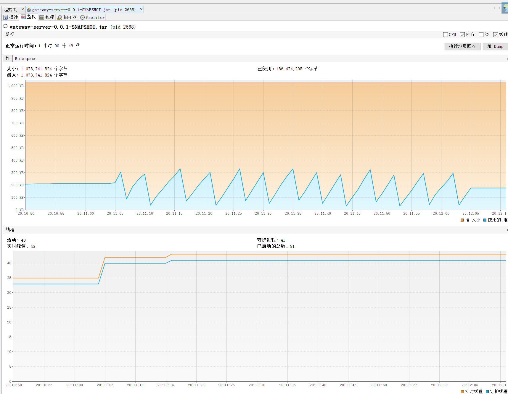

[TOC]

# JVM 作业

1、使用 GCLogAnalysis.java 自己演练一遍串行/并行/CMS/G1的案例。
2、使用压测工具（wrk或sb），演练gateway-server-0.0.1-SNAPSHOT.jar 示例。
3、(选做)如果自己本地有可以运行的项目，可以按照2的方式进行演练。
根据上述自己对于1和2的演示，写一段对于不同 GC 的总结，提交到 Github。

### 运行环境说明  

基本运行环境：windows 10, 16G内存
压测工具：SuperBenchmarker（sb）
JDK版本：JDK 1.8.0_161(64位)

编译字节码：`javac  -encoding UTF-8 GCLogAnalysis.java`

### 补充知识：GC日志格式

   

上图来自马士兵教育公开课

## JVM作业1：使用串行/并行/CMS/G1运行GCLogAnalysis.java

### （1）GC不变，比较不同内存大小对GC的影响

#### 0. 默认GC：并行GC
启动参数：`java -Xloggc:gc.demo.log -XX:+PrintGCDetails -XX:+PrintGCDateStamps GCLogAnalysis`

程序输出：
```text
正在执行...
执行结束！共生成对象次数:12201
```

GC日志：
```text
Java HotSpot(TM) 64-Bit Server VM (25.161-b12) for windows-amd64 JRE (1.8.0_161-b12), built on Dec 19 2017 17:52:25 by "java_re" with MS VC++ 10.0 (VS2010)
Memory: 4k page, physical 16676452k(4562116k free), swap 31894912k(8986356k free)
CommandLine flags: -XX:InitialHeapSize=266823232 -XX:MaxHeapSize=4269171712 -XX:+PrintGC -XX:+PrintGCDateStamps -XX:+PrintGCDetails -XX:+PrintGCTimeStamps -XX:+UseCompressedClassPointers -XX:+UseCompressedOops -XX:-UseLargePagesIndividualAllocation -XX:+UseParallelGC 
2020-10-27T16:32:00.145+0800: 0.166: [GC (Allocation Failure) [PSYoungGen: 65536K->10745K(76288K)] 65536K->22249K(251392K), 0.0045970 secs] [Times: user=0.00 sys=0.00, real=0.01 secs] 
2020-10-27T16:32:00.161+0800: 0.181: [GC (Allocation Failure) [PSYoungGen: 76281K->10750K(141824K)] 87785K->44860K(316928K), 0.0056487 secs] [Times: user=0.00 sys=0.00, real=0.00 secs] 
2020-10-27T16:32:00.205+0800: 0.225: [GC (Allocation Failure) [PSYoungGen: 141822K->10745K(141824K)] 175932K->88358K(316928K), 0.0098001 secs] [Times: user=0.00 sys=0.01, real=0.01 secs] 
2020-10-27T16:32:00.232+0800: 0.252: [GC (Allocation Failure) [PSYoungGen: 141817K->10738K(272896K)] 219430K->131132K(448000K), 0.0099919 secs] [Times: user=0.00 sys=0.00, real=0.01 secs] 
2020-10-27T16:32:00.242+0800: 0.262: [Full GC (Ergonomics) [PSYoungGen: 10738K->0K(272896K)] [ParOldGen: 120393K->116128K(253440K)] 131132K->116128K(526336K), [Metaspace: 2747K->2747K(1056768K)], 0.0169237 secs] [Times: user=0.02 sys=0.00, real=0.02 secs] 
2020-10-27T16:32:00.351+0800: 0.371: [GC (Allocation Failure) [PSYoungGen: 262144K->10750K(272896K)] 378272K->201198K(526336K), 0.0216877 secs] [Times: user=0.11 sys=0.14, real=0.02 secs] 
2020-10-27T16:32:00.373+0800: 0.393: [Full GC (Ergonomics) [PSYoungGen: 10750K->0K(272896K)] [ParOldGen: 190447K->176482K(366080K)] 201198K->176482K(638976K), [Metaspace: 2747K->2747K(1056768K)], 0.0216882 secs] [Times: user=0.11 sys=0.00, real=0.02 secs] 
2020-10-27T16:32:00.429+0800: 0.450: [GC (Allocation Failure) [PSYoungGen: 262144K->86321K(535552K)] 438626K->262804K(901632K), 0.0306099 secs] [Times: user=0.09 sys=0.13, real=0.03 secs] 
2020-10-27T16:32:00.586+0800: 0.607: [GC (Allocation Failure) [PSYoungGen: 529201K->106483K(549376K)] 705684K->365285K(915456K), 0.0457477 secs] [Times: user=0.11 sys=0.20, real=0.05 secs] 
2020-10-27T16:32:00.687+0800: 0.708: [GC (Allocation Failure) [PSYoungGen: 549363K->166394K(874496K)] 808165K->453443K(1240576K), 0.0430839 secs] [Times: user=0.14 sys=0.20, real=0.04 secs] 
2020-10-27T16:32:00.730+0800: 0.751: [Full GC (Ergonomics) [PSYoungGen: 166394K->0K(874496K)] [ParOldGen: 287048K->314484K(530432K)] 453443K->314484K(1404928K), [Metaspace: 2747K->2747K(1056768K)], 0.0428480 secs] [Times: user=0.20 sys=0.03, real=0.04 secs] 
2020-10-27T16:32:00.911+0800: 0.931: [GC (Allocation Failure) [PSYoungGen: 708096K->191850K(915968K)] 1022580K->506334K(1446400K), 0.0436436 secs] [Times: user=0.08 sys=0.25, real=0.04 secs] 
2020-10-27T16:32:01.044+0800: 1.064: [GC (Allocation Failure) [PSYoungGen: 899946K->236533K(1053696K)] 1214430K->586264K(1584128K), 0.0631403 secs] [Times: user=0.11 sys=0.28, real=0.06 secs] 
Heap
 PSYoungGen      total 1053696K, used 269408K [0x000000076b300000, 0x00000007c0000000, 0x00000007c0000000)
  eden space 817152K, 4% used [0x000000076b300000,0x000000076d31ad50,0x000000079d100000)
  from space 236544K, 99% used [0x00000007b1900000,0x00000007bfffd508,0x00000007c0000000)
  to   space 286208K, 0% used [0x000000079d100000,0x000000079d100000,0x00000007ae880000)
 ParOldGen       total 530432K, used 349731K [0x00000006c1800000, 0x00000006e1e00000, 0x000000076b300000)
  object space 530432K, 65% used [0x00000006c1800000,0x00000006d6d88d10,0x00000006e1e00000)
 Metaspace       used 2754K, capacity 4486K, committed 4864K, reserved 1056768K
  class space    used 306K, capacity 386K, committed 512K, reserved 1048576K
```
第一行：表示YGC，年轻代总大小76288K，回收前年轻代占用空间65536K，回收后10745K；堆总大小是251392K，回收前对占用空间是65536K，回收后占用22249K。
第二行：可以看到，由于启动时没有指定最大、最小堆的大小，再次发生GC时，年轻代总大小从76288K自动调整为141824K；堆总大小从251392K自动调整为316928K。
发生了3次Full GC。

#### 1. 并行GC，128M，模拟OOM

启动参数：`java -Xloggc:gc.demo-128m.log -Xms128m -Xmx128m -XX:+PrintGCDetails  GCLogAnalysis`

```text
Java HotSpot(TM) 64-Bit Server VM (25.161-b12) for windows-amd64 JRE (1.8.0_161-b12), built on Dec 19 2017 17:52:25 by "java_re" with MS VC++ 10.0 (VS2010)
Memory: 4k page, physical 16676452k(4648464k free), swap 31894912k(8572900k free)
CommandLine flags: -XX:InitialHeapSize=134217728 -XX:MaxHeapSize=134217728 -XX:+PrintGC -XX:+PrintGCDateStamps -XX:+PrintGCDetails -XX:+PrintGCTimeStamps -XX:+UseCompressedClassPointers -XX:+UseCompressedOops -XX:-UseLargePagesIndividualAllocation -XX:+UseParallelGC 
2020-10-27T16:45:51.649+0800: 0.134: [GC (Allocation Failure) [PSYoungGen: 32941K->5115K(38400K)] 32941K->15380K(125952K), 0.0035212 secs] [Times: user=0.00 sys=0.00, real=0.00 secs] 
2020-10-27T16:45:51.668+0800: 0.153: [GC (Allocation Failure) [PSYoungGen: 38212K->5115K(38400K)] 48477K->28215K(125952K), 0.0037579 secs] [Times: user=0.02 sys=0.02, real=0.00 secs] 
2020-10-27T16:45:51.679+0800: 0.164: [GC (Allocation Failure) [PSYoungGen: 38305K->5119K(38400K)] 61405K->39021K(125952K), 0.0029942 secs] [Times: user=0.00 sys=0.00, real=0.00 secs] 
2020-10-27T16:45:51.687+0800: 0.173: [GC (Allocation Failure) [PSYoungGen: 38368K->5114K(38400K)] 72270K->49202K(125952K), 0.0033339 secs] [Times: user=0.00 sys=0.00, real=0.00 secs] 
2020-10-27T16:45:51.699+0800: 0.184: [GC (Allocation Failure) [PSYoungGen: 38394K->5119K(38400K)] 82482K->60600K(125952K), 0.0029058 secs] [Times: user=0.00 sys=0.00, real=0.00 secs] 
2020-10-27T16:45:51.707+0800: 0.192: [GC (Allocation Failure) [PSYoungGen: 37847K->5110K(19968K)] 93328K->74456K(107520K), 0.0039866 secs] [Times: user=0.00 sys=0.00, real=0.00 secs] 
2020-10-27T16:45:51.713+0800: 0.198: [GC (Allocation Failure) [PSYoungGen: 19671K->8680K(29184K)] 89017K->80680K(116736K), 0.0018334 secs] [Times: user=0.00 sys=0.00, real=0.00 secs] 
2020-10-27T16:45:51.715+0800: 0.200: [Full GC (Ergonomics) [PSYoungGen: 8680K->0K(29184K)] [ParOldGen: 71999K->73759K(87552K)] 80680K->73759K(116736K), [Metaspace: 2747K->2747K(1056768K)], 0.0114334 secs] [Times: user=0.13 sys=0.00, real=0.01 secs] 
2020-10-27T16:45:51.729+0800: 0.214: [Full GC (Ergonomics) [PSYoungGen: 14701K->0K(29184K)] [ParOldGen: 73759K->78056K(87552K)] 88461K->78056K(116736K), [Metaspace: 2747K->2747K(1056768K)], 0.0096711 secs] [Times: user=0.11 sys=0.00, real=0.01 secs] 
2020-10-27T16:45:51.740+0800: 0.225: [Full GC (Ergonomics) [PSYoungGen: 14687K->0K(29184K)] [ParOldGen: 78056K->81186K(87552K)] 92744K->81186K(116736K), [Metaspace: 2747K->2747K(1056768K)], 0.0121253 secs] [Times: user=0.13 sys=0.00, real=0.01 secs] 
2020-10-27T16:45:51.755+0800: 0.240: [Full GC (Ergonomics) [PSYoungGen: 14763K->0K(29184K)] [ParOldGen: 81186K->87290K(87552K)] 95950K->87290K(116736K), [Metaspace: 2747K->2747K(1056768K)], 0.0048072 secs] [Times: user=0.00 sys=0.00, real=0.00 secs] 
2020-10-27T16:45:51.762+0800: 0.247: [Full GC (Ergonomics) [PSYoungGen: 14779K->3035K(29184K)] [ParOldGen: 87290K->87213K(87552K)] 102069K->90248K(116736K), [Metaspace: 2747K->2747K(1056768K)], 0.0106891 secs] [Times: user=0.13 sys=0.00, real=0.01 secs] 
2020-10-27T16:45:51.775+0800: 0.260: [Full GC (Ergonomics) [PSYoungGen: 14848K->5610K(29184K)] [ParOldGen: 87213K->87316K(87552K)] 102061K->92927K(116736K), [Metaspace: 2747K->2747K(1056768K)], 0.0117118 secs] [Times: user=0.13 sys=0.00, real=0.01 secs] 
2020-10-27T16:45:51.788+0800: 0.273: [Full GC (Ergonomics) [PSYoungGen: 14848K->8150K(29184K)] [ParOldGen: 87316K->87538K(87552K)] 102164K->95688K(116736K), [Metaspace: 2747K->2747K(1056768K)], 0.0049957 secs] [Times: user=0.00 sys=0.00, real=0.00 secs] 
2020-10-27T16:45:51.794+0800: 0.279: [Full GC (Ergonomics) [PSYoungGen: 14848K->11129K(29184K)] [ParOldGen: 87538K->87418K(87552K)] 102386K->98547K(116736K), [Metaspace: 2747K->2747K(1056768K)], 0.0126848 secs] [Times: user=0.13 sys=0.00, real=0.01 secs] 
2020-10-27T16:45:51.808+0800: 0.293: [Full GC (Ergonomics) [PSYoungGen: 14438K->12647K(29184K)] [ParOldGen: 87418K->87347K(87552K)] 101857K->99994K(116736K), [Metaspace: 2747K->2747K(1056768K)], 0.0027195 secs] [Times: user=0.00 sys=0.00, real=0.00 secs] 
2020-10-27T16:45:51.811+0800: 0.296: [Full GC (Ergonomics) [PSYoungGen: 14748K->13170K(29184K)] [ParOldGen: 87347K->87153K(87552K)] 102095K->100323K(116736K), [Metaspace: 2747K->2747K(1056768K)], 0.0105647 secs] [Times: user=0.13 sys=0.00, real=0.01 secs] 
2020-10-27T16:45:51.822+0800: 0.307: [Full GC (Ergonomics) [PSYoungGen: 14779K->13458K(29184K)] [ParOldGen: 87153K->87153K(87552K)] 101933K->100611K(116736K), [Metaspace: 2747K->2747K(1056768K)], 0.0019075 secs] [Times: user=0.00 sys=0.00, real=0.00 secs] 
2020-10-27T16:45:51.824+0800: 0.309: [Full GC (Ergonomics) [PSYoungGen: 14533K->13034K(29184K)] [ParOldGen: 87153K->87017K(87552K)] 101687K->100051K(116736K), [Metaspace: 2747K->2747K(1056768K)], 0.0111905 secs] [Times: user=0.13 sys=0.00, real=0.01 secs] 
2020-10-27T16:45:51.836+0800: 0.320: [Full GC (Ergonomics) [PSYoungGen: 14769K->13147K(29184K)] [ParOldGen: 87017K->87227K(87552K)] 101786K->100374K(116736K), [Metaspace: 2747K->2747K(1056768K)], 0.0089639 secs] [Times: user=0.06 sys=0.02, real=0.01 secs] 
2020-10-27T16:45:51.845+0800: 0.330: [Full GC (Ergonomics) [PSYoungGen: 14836K->13279K(29184K)] [ParOldGen: 87227K->87476K(87552K)] 102063K->100755K(116736K), [Metaspace: 2747K->2747K(1056768K)], 0.0121002 secs] [Times: user=0.00 sys=0.00, real=0.01 secs] 
2020-10-27T16:45:51.858+0800: 0.342: [Full GC (Ergonomics) [PSYoungGen: 14773K->13453K(29184K)] [ParOldGen: 87476K->87484K(87552K)] 102249K->100938K(116736K), [Metaspace: 2747K->2747K(1056768K)], 0.0120434 secs] [Times: user=0.11 sys=0.00, real=0.01 secs] 
2020-10-27T16:45:51.870+0800: 0.355: [Full GC (Ergonomics) [PSYoungGen: 14809K->14380K(29184K)] [ParOldGen: 87484K->87484K(87552K)] 102293K->101865K(116736K), [Metaspace: 2747K->2747K(1056768K)], 0.0032318 secs] [Times: user=0.00 sys=0.00, real=0.00 secs] 
2020-10-27T16:45:51.874+0800: 0.358: [Full GC (Ergonomics) [PSYoungGen: 14643K->14429K(29184K)] [ParOldGen: 87484K->87231K(87552K)] 102128K->101660K(116736K), [Metaspace: 2747K->2747K(1056768K)], 0.0094378 secs] [Times: user=0.13 sys=0.00, real=0.01 secs] 
2020-10-27T16:45:51.883+0800: 0.368: [Full GC (Ergonomics) [PSYoungGen: 14811K->14429K(29184K)] [ParOldGen: 87231K->87231K(87552K)] 102042K->101660K(116736K), [Metaspace: 2747K->2747K(1056768K)], 0.0022445 secs] [Times: user=0.00 sys=0.00, real=0.00 secs] 
2020-10-27T16:45:51.886+0800: 0.371: [Full GC (Ergonomics) [PSYoungGen: 14758K->14573K(29184K)] [ParOldGen: 87231K->87231K(87552K)] 101989K->101804K(116736K), [Metaspace: 2747K->2747K(1056768K)], 0.0019043 secs] [Times: user=0.00 sys=0.00, real=0.00 secs] 
2020-10-27T16:45:51.888+0800: 0.373: [Full GC (Ergonomics) [PSYoungGen: 14845K->14501K(29184K)] [ParOldGen: 87231K->87231K(87552K)] 102076K->101732K(116736K), [Metaspace: 2747K->2747K(1056768K)], 0.0017724 secs] [Times: user=0.00 sys=0.00, real=0.00 secs] 
2020-10-27T16:45:51.890+0800: 0.375: [Full GC (Ergonomics) [PSYoungGen: 14569K->14497K(29184K)] [ParOldGen: 87231K->86934K(87552K)] 101800K->101432K(116736K), [Metaspace: 2747K->2747K(1056768K)], 0.0048484 secs] [Times: user=0.02 sys=0.00, real=0.00 secs] 
2020-10-27T16:45:51.895+0800: 0.380: [Full GC (Ergonomics) [PSYoungGen: 14844K->14575K(29184K)] [ParOldGen: 87521K->87095K(87552K)] 102365K->101670K(116736K), [Metaspace: 2747K->2747K(1056768K)], 0.0018480 secs] [Times: user=0.00 sys=0.00, real=0.00 secs] 
2020-10-27T16:45:51.897+0800: 0.382: [Full GC (Ergonomics) [PSYoungGen: 14641K->14575K(29184K)] [ParOldGen: 87095K->87023K(87552K)] 101736K->101598K(116736K), [Metaspace: 2747K->2747K(1056768K)], 0.0016334 secs] [Times: user=0.00 sys=0.00, real=0.00 secs] 
2020-10-27T16:45:51.899+0800: 0.384: [Full GC (Ergonomics) [PSYoungGen: 14831K->14575K(29184K)] [ParOldGen: 87023K->87023K(87552K)] 101855K->101598K(116736K), [Metaspace: 2747K->2747K(1056768K)], 0.0017319 secs] [Times: user=0.00 sys=0.00, real=0.00 secs] 
2020-10-27T16:45:51.901+0800: 0.386: [Full GC (Ergonomics) [PSYoungGen: 14845K->14651K(29184K)] [ParOldGen: 87023K->87023K(87552K)] 101868K->101674K(116736K), [Metaspace: 2747K->2747K(1056768K)], 0.0015905 secs] [Times: user=0.00 sys=0.00, real=0.00 secs] 
2020-10-27T16:45:51.903+0800: 0.387: [Full GC (Ergonomics) [PSYoungGen: 14810K->14736K(29184K)] [ParOldGen: 87023K->87023K(87552K)] 101833K->101759K(116736K), [Metaspace: 2747K->2747K(1056768K)], 0.0018174 secs] [Times: user=0.00 sys=0.00, real=0.00 secs] 
2020-10-27T16:45:51.905+0800: 0.389: [Full GC (Ergonomics) [PSYoungGen: 14816K->14772K(29184K)] [ParOldGen: 87023K->87023K(87552K)] 101839K->101795K(116736K), [Metaspace: 2747K->2747K(1056768K)], 0.0016863 secs] [Times: user=0.00 sys=0.00, real=0.00 secs] 
2020-10-27T16:45:51.907+0800: 0.391: [Full GC (Ergonomics) [PSYoungGen: 14845K->14700K(29184K)] [ParOldGen: 87488K->86798K(87552K)] 102334K->101498K(116736K), [Metaspace: 2747K->2747K(1056768K)], 0.0137549 secs] [Times: user=0.00 sys=0.00, real=0.01 secs] 
2020-10-27T16:45:51.921+0800: 0.405: [Full GC (Ergonomics) [PSYoungGen: 14848K->14041K(29184K)] [ParOldGen: 86798K->87529K(87552K)] 101646K->101570K(116736K), [Metaspace: 2747K->2747K(1056768K)], 0.0032534 secs] [Times: user=0.13 sys=0.00, real=0.00 secs] 
2020-10-27T16:45:51.924+0800: 0.409: [Full GC (Ergonomics) [PSYoungGen: 14698K->14185K(29184K)] [ParOldGen: 87529K->87529K(87552K)] 102228K->101714K(116736K), [Metaspace: 2747K->2747K(1056768K)], 0.0021462 secs] [Times: user=0.00 sys=0.00, real=0.00 secs] 
2020-10-27T16:45:51.927+0800: 0.412: [Full GC (Ergonomics) [PSYoungGen: 14822K->13934K(29184K)] [ParOldGen: 87529K->87529K(87552K)] 102352K->101463K(116736K), [Metaspace: 2747K->2747K(1056768K)], 0.0021307 secs] [Times: user=0.00 sys=0.00, real=0.00 secs] 
2020-10-27T16:45:51.929+0800: 0.414: [Full GC (Ergonomics) [PSYoungGen: 14788K->14517K(29184K)] [ParOldGen: 87529K->87529K(87552K)] 102318K->102047K(116736K), [Metaspace: 2747K->2747K(1056768K)], 0.0019731 secs] [Times: user=0.00 sys=0.00, real=0.00 secs] 
2020-10-27T16:45:51.932+0800: 0.416: [Full GC (Ergonomics) [PSYoungGen: 14818K->14661K(29184K)] [ParOldGen: 87529K->87529K(87552K)] 102347K->102191K(116736K), [Metaspace: 2747K->2747K(1056768K)], 0.0017562 secs] [Times: user=0.00 sys=0.00, real=0.00 secs] 
2020-10-27T16:45:51.934+0800: 0.418: [Full GC (Ergonomics) [PSYoungGen: 14829K->14373K(29184K)] [ParOldGen: 87529K->87529K(87552K)] 102358K->101903K(116736K), [Metaspace: 2747K->2747K(1056768K)], 0.0017501 secs] [Times: user=0.00 sys=0.00, real=0.00 secs] 
2020-10-27T16:45:51.935+0800: 0.420: [Full GC (Allocation Failure) [PSYoungGen: 14373K->14373K(29184K)] [ParOldGen: 87529K->87509K(87552K)] 101903K->101883K(116736K), [Metaspace: 2747K->2747K(1056768K)], 0.0176345 secs] [Times: user=0.13 sys=0.00, real=0.02 secs] 
Heap
 PSYoungGen      total 29184K, used 14681K [0x00000000fd580000, 0x0000000100000000, 0x0000000100000000)
  eden space 14848K, 98% used [0x00000000fd580000,0x00000000fe3d6448,0x00000000fe400000)
  from space 14336K, 0% used [0x00000000fe400000,0x00000000fe400000,0x00000000ff200000)
  to   space 14336K, 0% used [0x00000000ff200000,0x00000000ff200000,0x0000000100000000)
 ParOldGen       total 87552K, used 87509K [0x00000000f8000000, 0x00000000fd580000, 0x00000000fd580000)
  object space 87552K, 99% used [0x00000000f8000000,0x00000000fd5757b8,0x00000000fd580000)
 Metaspace       used 2777K, capacity 4486K, committed 4864K, reserved 1056768K
  class space    used 309K, capacity 386K, committed 512K, reserved 1048576K

```
由于程序指定了堆（最大、最小）为128M，不够用，导致从第一次发生Full GC开始，基本上老年代就已经没再变化、无法回收。由于没有额外内存可用，程序发生OOM，抛出异常。

#### 2. 并行GC，512M
启动参数`java -Xloggc:gc.demo-512m.log -Xms512m -Xmx512m -XX:+PrintGCDetails -XX:+PrintGCDateStamps GCLogAnalysis`

程序输出：
```text
正在执行...
执行结束！共生成对象次数:7991
```

GC日志：
```text
Java HotSpot(TM) 64-Bit Server VM (25.161-b12) for windows-amd64 JRE (1.8.0_161-b12), built on Dec 19 2017 17:52:25 by "java_re" with MS VC++ 10.0 (VS2010)
Memory: 4k page, physical 16676452k(3005572k free), swap 31894912k(6470048k free)
CommandLine flags: -XX:InitialHeapSize=536870912 -XX:MaxHeapSize=536870912 -XX:+PrintGC -XX:+PrintGCDateStamps -XX:+PrintGCDetails -XX:+PrintGCTimeStamps -XX:+UseCompressedClassPointers -XX:+UseCompressedOops -XX:-UseLargePagesIndividualAllocation -XX:+UseParallelGC 
2020-10-27T17:17:01.503+0800: 0.313: [GC (Allocation Failure) [PSYoungGen: 131584K->21502K(153088K)] 131584K->39480K(502784K), 0.0128413 secs] [Times: user=0.02 sys=0.00, real=0.01 secs] 
2020-10-27T17:17:01.540+0800: 0.350: [GC (Allocation Failure) [PSYoungGen: 153086K->21484K(153088K)] 171064K->86095K(502784K), 0.0200316 secs] [Times: user=0.03 sys=0.05, real=0.02 secs] 
2020-10-27T17:17:01.587+0800: 0.397: [GC (Allocation Failure) [PSYoungGen: 153068K->21490K(153088K)] 217679K->128030K(502784K), 0.0148140 secs] [Times: user=0.02 sys=0.09, real=0.02 secs] 
2020-10-27T17:17:01.624+0800: 0.434: [GC (Allocation Failure) [PSYoungGen: 153074K->21497K(153088K)] 259614K->176682K(502784K), 0.0161399 secs] [Times: user=0.09 sys=0.00, real=0.02 secs] 
2020-10-27T17:17:01.661+0800: 0.471: [GC (Allocation Failure) [PSYoungGen: 153020K->21498K(153088K)] 308205K->217443K(502784K), 0.0149103 secs] [Times: user=0.05 sys=0.03, real=0.02 secs] 
2020-10-27T17:17:01.700+0800: 0.510: [GC (Allocation Failure) [PSYoungGen: 152915K->21500K(80384K)] 348860K->263558K(430080K), 0.0155352 secs] [Times: user=0.00 sys=0.11, real=0.02 secs] 
2020-10-27T17:17:01.728+0800: 0.538: [GC (Allocation Failure) [PSYoungGen: 80227K->37838K(116736K)] 322285K->284430K(466432K), 0.0057607 secs] [Times: user=0.00 sys=0.00, real=0.01 secs] 
2020-10-27T17:17:01.746+0800: 0.556: [GC (Allocation Failure) [PSYoungGen: 96718K->55644K(116736K)] 343310K->306295K(466432K), 0.0080763 secs] [Times: user=0.06 sys=0.02, real=0.01 secs] 
2020-10-27T17:17:01.765+0800: 0.575: [GC (Allocation Failure) [PSYoungGen: 114492K->57844K(116736K)] 365143K->326656K(466432K), 0.0143888 secs] [Times: user=0.09 sys=0.00, real=0.01 secs] 
2020-10-27T17:17:01.791+0800: 0.601: [GC (Allocation Failure) [PSYoungGen: 116724K->39850K(116736K)] 385536K->342591K(466432K), 0.0128089 secs] [Times: user=0.03 sys=0.08, real=0.01 secs] 
2020-10-27T17:17:01.804+0800: 0.614: [Full GC (Ergonomics) [PSYoungGen: 39850K->0K(116736K)] [ParOldGen: 302741K->240011K(349696K)] 342591K->240011K(466432K), [Metaspace: 2747K->2747K(1056768K)], 0.0394372 secs] [Times: user=0.13 sys=0.00, real=0.04 secs] 
2020-10-27T17:17:01.857+0800: 0.667: [GC (Allocation Failure) [PSYoungGen: 58880K->20789K(116736K)] 298891K->260800K(466432K), 0.0031349 secs] [Times: user=0.11 sys=0.00, real=0.00 secs] 
2020-10-27T17:17:01.871+0800: 0.680: [GC (Allocation Failure) [PSYoungGen: 79633K->23942K(116736K)] 319644K->283418K(466432K), 0.0050732 secs] [Times: user=0.13 sys=0.00, real=0.00 secs] 
2020-10-27T17:17:01.887+0800: 0.697: [GC (Allocation Failure) [PSYoungGen: 82697K->17806K(116736K)] 342172K->300543K(466432K), 0.0052691 secs] [Times: user=0.13 sys=0.00, real=0.00 secs] 
2020-10-27T17:17:01.903+0800: 0.713: [GC (Allocation Failure) [PSYoungGen: 76613K->22649K(116736K)] 359350K->321553K(466432K), 0.0048481 secs] [Times: user=0.13 sys=0.00, real=0.00 secs] 
2020-10-27T17:17:01.908+0800: 0.718: [Full GC (Ergonomics) [PSYoungGen: 22649K->0K(116736K)] [ParOldGen: 298903K->267282K(349696K)] 321553K->267282K(466432K), [Metaspace: 2747K->2747K(1056768K)], 0.0320668 secs] [Times: user=0.22 sys=0.00, real=0.03 secs] 
2020-10-27T17:17:01.951+0800: 0.761: [GC (Allocation Failure) [PSYoungGen: 58880K->22765K(116736K)] 326162K->290048K(466432K), 0.0032662 secs] [Times: user=0.11 sys=0.00, real=0.00 secs] 
2020-10-27T17:17:01.966+0800: 0.776: [GC (Allocation Failure) [PSYoungGen: 81645K->20878K(116736K)] 348928K->309575K(466432K), 0.0052699 secs] [Times: user=0.09 sys=0.00, real=0.00 secs] 
2020-10-27T17:17:01.985+0800: 0.795: [GC (Allocation Failure) [PSYoungGen: 79758K->17493K(116736K)] 368455K->325592K(466432K), 0.0058931 secs] [Times: user=0.00 sys=0.00, real=0.01 secs] 
2020-10-27T17:17:01.991+0800: 0.801: [Full GC (Ergonomics) [PSYoungGen: 17493K->0K(116736K)] [ParOldGen: 308099K->281047K(349696K)] 325592K->281047K(466432K), [Metaspace: 2747K->2747K(1056768K)], 0.0342663 secs] [Times: user=0.22 sys=0.00, real=0.04 secs] 
2020-10-27T17:17:02.038+0800: 0.848: [GC (Allocation Failure) [PSYoungGen: 58880K->21059K(116736K)] 339927K->302106K(466432K), 0.0033960 secs] [Times: user=0.00 sys=0.00, real=0.00 secs] 
2020-10-27T17:17:02.055+0800: 0.865: [GC (Allocation Failure) [PSYoungGen: 79939K->16959K(116736K)] 360986K->317933K(466432K), 0.0047904 secs] [Times: user=0.00 sys=0.00, real=0.00 secs] 
2020-10-27T17:17:02.073+0800: 0.883: [GC (Allocation Failure) [PSYoungGen: 75740K->18226K(116736K)] 376713K->335123K(466432K), 0.0071209 secs] [Times: user=0.06 sys=0.02, real=0.01 secs] 
2020-10-27T17:17:02.081+0800: 0.890: [Full GC (Ergonomics) [PSYoungGen: 18226K->0K(116736K)] [ParOldGen: 316897K->292630K(349696K)] 335123K->292630K(466432K), [Metaspace: 2747K->2747K(1056768K)], 0.0345300 secs] [Times: user=0.20 sys=0.00, real=0.03 secs] 
2020-10-27T17:17:02.128+0800: 0.937: [GC (Allocation Failure) [PSYoungGen: 58854K->19252K(116736K)] 351484K->311882K(466432K), 0.0030326 secs] [Times: user=0.00 sys=0.00, real=0.00 secs] 
2020-10-27T17:17:02.142+0800: 0.952: [GC (Allocation Failure) [PSYoungGen: 78132K->18703K(116736K)] 370762K->329145K(466432K), 0.0053714 secs] [Times: user=0.00 sys=0.00, real=0.01 secs] 
2020-10-27T17:17:02.158+0800: 0.968: [GC (Allocation Failure) [PSYoungGen: 77583K->18471K(116736K)] 388025K->346419K(466432K), 0.0060319 secs] [Times: user=0.00 sys=0.00, real=0.01 secs] 
2020-10-27T17:17:02.165+0800: 0.974: [Full GC (Ergonomics) [PSYoungGen: 18471K->0K(116736K)] [ParOldGen: 327948K->306757K(349696K)] 346419K->306757K(466432K), [Metaspace: 2747K->2747K(1056768K)], 0.0368989 secs] [Times: user=0.19 sys=0.00, real=0.04 secs] 
2020-10-27T17:17:02.213+0800: 1.023: [GC (Allocation Failure) [PSYoungGen: 58880K->17836K(116736K)] 365637K->324593K(466432K), 0.0033044 secs] [Times: user=0.00 sys=0.00, real=0.00 secs] 
2020-10-27T17:17:02.232+0800: 1.042: [GC (Allocation Failure) [PSYoungGen: 76716K->17908K(116736K)] 383473K->340545K(466432K), 0.0050841 secs] [Times: user=0.08 sys=0.00, real=0.00 secs] 
2020-10-27T17:17:02.237+0800: 1.047: [Full GC (Ergonomics) [PSYoungGen: 17908K->0K(116736K)] [ParOldGen: 322636K->307806K(349696K)] 340545K->307806K(466432K), [Metaspace: 2747K->2747K(1056768K)], 0.0408221 secs] [Times: user=0.08 sys=0.00, real=0.04 secs] 
2020-10-27T17:17:02.291+0800: 1.101: [GC (Allocation Failure) [PSYoungGen: 58880K->20343K(116736K)] 366686K->328150K(466432K), 0.0032162 secs] [Times: user=0.00 sys=0.00, real=0.00 secs] 
2020-10-27T17:17:02.310+0800: 1.119: [GC (Allocation Failure) [PSYoungGen: 79215K->21501K(116736K)] 387021K->348829K(466432K), 0.0057529 secs] [Times: user=0.11 sys=0.00, real=0.01 secs] 
2020-10-27T17:17:02.316+0800: 1.125: [Full GC (Ergonomics) [PSYoungGen: 21501K->0K(116736K)] [ParOldGen: 327328K->315560K(349696K)] 348829K->315560K(466432K), [Metaspace: 2747K->2747K(1056768K)], 0.0392652 secs] [Times: user=0.17 sys=0.00, real=0.04 secs] 
2020-10-27T17:17:02.368+0800: 1.178: [GC (Allocation Failure) [PSYoungGen: 58880K->19938K(116736K)] 374440K->335499K(466432K), 0.0032642 secs] [Times: user=0.00 sys=0.00, real=0.00 secs] 
Heap
 PSYoungGen      total 116736K, used 34984K [0x00000000f5580000, 0x0000000100000000, 0x0000000100000000)
  eden space 58880K, 25% used [0x00000000f5580000,0x00000000f64318e8,0x00000000f8f00000)
  from space 57856K, 34% used [0x00000000fc780000,0x00000000fdaf8ad0,0x0000000100000000)
  to   space 57856K, 0% used [0x00000000f8f00000,0x00000000f8f00000,0x00000000fc780000)
 ParOldGen       total 349696K, used 315560K [0x00000000e0000000, 0x00000000f5580000, 0x00000000f5580000)
  object space 349696K, 90% used [0x00000000e0000000,0x00000000f342a3b0,0x00000000f5580000)
 Metaspace       used 2753K, capacity 4486K, committed 4864K, reserved 1056768K
  class space    used 306K, capacity 386K, committed 512K, reserved 1048576K

```

#### 3. 并行GC, 1024M

启动参数：`java -Xloggc:gc.demo-1024m.log -Xms1024m -Xmx1024m -XX:+PrintGCDetails -XX:+PrintGCDateStamps GCLogAnalysis`

GC日志：
```text
Java HotSpot(TM) 64-Bit Server VM (25.161-b12) for windows-amd64 JRE (1.8.0_161-b12), built on Dec 19 2017 17:52:25 by "java_re" with MS VC++ 10.0 (VS2010)
Memory: 4k page, physical 16676452k(2831600k free), swap 31894912k(5959172k free)
CommandLine flags: -XX:InitialHeapSize=1073741824 -XX:MaxHeapSize=1073741824 -XX:+PrintGC -XX:+PrintGCDateStamps -XX:+PrintGCDetails -XX:+PrintGCTimeStamps -XX:+UseCompressedClassPointers -XX:+UseCompressedOops -XX:-UseLargePagesIndividualAllocation -XX:+UseParallelGC 
2020-10-27T17:25:38.156+0800: 0.396: [GC (Allocation Failure) [PSYoungGen: 262144K->43519K(305664K)] 262144K->87958K(1005056K), 0.0287312 secs] [Times: user=0.08 sys=0.09, real=0.03 secs] 
2020-10-27T17:25:38.240+0800: 0.480: [GC (Allocation Failure) [PSYoungGen: 305663K->43519K(305664K)] 350102K->165040K(1005056K), 0.0355749 secs] [Times: user=0.05 sys=0.14, real=0.04 secs] 
2020-10-27T17:25:38.330+0800: 0.570: [GC (Allocation Failure) [PSYoungGen: 305663K->43511K(305664K)] 427184K->236973K(1005056K), 0.0320741 secs] [Times: user=0.13 sys=0.09, real=0.03 secs] 
2020-10-27T17:25:38.418+0800: 0.657: [GC (Allocation Failure) [PSYoungGen: 305655K->43503K(305664K)] 499117K->310711K(1005056K), 0.0311844 secs] [Times: user=0.05 sys=0.13, real=0.03 secs] 
2020-10-27T17:25:38.512+0800: 0.751: [GC (Allocation Failure) [PSYoungGen: 305514K->43507K(305664K)] 572722K->383959K(1005056K), 0.0327196 secs] [Times: user=0.05 sys=0.09, real=0.03 secs] 
2020-10-27T17:25:38.596+0800: 0.836: [GC (Allocation Failure) [PSYoungGen: 305651K->43518K(160256K)] 646103K->459392K(859648K), 0.0366147 secs] [Times: user=0.13 sys=0.09, real=0.04 secs] 
2020-10-27T17:25:38.656+0800: 0.895: [GC (Allocation Failure) [PSYoungGen: 160254K->72354K(232960K)] 576128K->494235K(932352K), 0.0117464 secs] [Times: user=0.06 sys=0.02, real=0.01 secs] 
2020-10-27T17:25:38.692+0800: 0.932: [GC (Allocation Failure) [PSYoungGen: 189090K->91149K(232960K)] 610971K->522803K(932352K), 0.0124810 secs] [Times: user=0.00 sys=0.00, real=0.01 secs] 
2020-10-27T17:25:38.725+0800: 0.965: [GC (Allocation Failure) [PSYoungGen: 207885K->96820K(232960K)] 639539K->545672K(932352K), 0.0157865 secs] [Times: user=0.08 sys=0.05, real=0.02 secs] 
2020-10-27T17:25:38.764+0800: 1.004: [GC (Allocation Failure) [PSYoungGen: 213556K->71931K(232960K)] 662408K->576241K(932352K), 0.0218831 secs] [Times: user=0.09 sys=0.16, real=0.02 secs] 
2020-10-27T17:25:38.812+0800: 1.051: [GC (Allocation Failure) [PSYoungGen: 188460K->42786K(232960K)] 692770K->607217K(932352K), 0.0237821 secs] [Times: user=0.06 sys=0.11, real=0.02 secs] 
2020-10-27T17:25:38.856+0800: 1.096: [GC (Allocation Failure) [PSYoungGen: 159522K->38698K(232960K)] 723953K->640401K(932352K), 0.0153754 secs] [Times: user=0.05 sys=0.06, real=0.02 secs] 
2020-10-27T17:25:38.872+0800: 1.111: [Full GC (Ergonomics) [PSYoungGen: 38698K->0K(232960K)] [ParOldGen: 601702K->325457K(699392K)] 640401K->325457K(932352K), [Metaspace: 2747K->2747K(1056768K)], 0.0515720 secs] [Times: user=0.25 sys=0.02, real=0.05 secs] 
Heap
 PSYoungGen      total 232960K, used 5034K [0x00000000eab00000, 0x0000000100000000, 0x0000000100000000)
  eden space 116736K, 4% used [0x00000000eab00000,0x00000000eafea968,0x00000000f1d00000)
  from space 116224K, 0% used [0x00000000f8e80000,0x00000000f8e80000,0x0000000100000000)
  to   space 116224K, 0% used [0x00000000f1d00000,0x00000000f1d00000,0x00000000f8e80000)
 ParOldGen       total 699392K, used 325457K [0x00000000c0000000, 0x00000000eab00000, 0x00000000eab00000)
  object space 699392K, 46% used [0x00000000c0000000,0x00000000d3dd4638,0x00000000eab00000)
 Metaspace       used 2753K, capacity 4486K, committed 4864K, reserved 1056768K
  class space    used 306K, capacity 386K, committed 512K, reserved 1048576K

```

程序输出：
```text
正在执行...
执行结束！共生成对象次数:8564
```


#### 4. 并行GC, 2048M

启动参数：`java -Xloggc:gc.demo-2048m.log -Xms2048m -Xmx2048m -XX:+PrintGCDetails -XX:+PrintGCDateStamps GCLogAnalysis`

程序输出：
```text
正在执行...
执行结束！共生成对象次数:8967
```

GC日志：
```text
Java HotSpot(TM) 64-Bit Server VM (25.161-b12) for windows-amd64 JRE (1.8.0_161-b12), built on Dec 19 2017 17:52:25 by "java_re" with MS VC++ 10.0 (VS2010)
Memory: 4k page, physical 16676452k(2939348k free), swap 31894912k(6172324k free)
CommandLine flags: -XX:InitialHeapSize=2147483648 -XX:MaxHeapSize=2147483648 -XX:+PrintGC -XX:+PrintGCDateStamps -XX:+PrintGCDetails -XX:+PrintGCTimeStamps -XX:+UseCompressedClassPointers -XX:+UseCompressedOops -XX:-UseLargePagesIndividualAllocation -XX:+UseParallelGC 
2020-10-27T17:26:28.150+0800: 0.590: [GC (Allocation Failure) [PSYoungGen: 524800K->87035K(611840K)] 524800K->156721K(2010112K), 0.0556182 secs] [Times: user=0.05 sys=0.17, real=0.06 secs] 
2020-10-27T17:26:28.325+0800: 0.765: [GC (Allocation Failure) [PSYoungGen: 611835K->87037K(611840K)] 681521K->264441K(2010112K), 0.0548564 secs] [Times: user=0.13 sys=0.22, real=0.06 secs] 
2020-10-27T17:26:28.474+0800: 0.914: [GC (Allocation Failure) [PSYoungGen: 611837K->87030K(611840K)] 789241K->367209K(2010112K), 0.0355373 secs] [Times: user=0.03 sys=0.19, real=0.04 secs] 
2020-10-27T17:26:28.601+0800: 1.041: [GC (Allocation Failure) [PSYoungGen: 611830K->87026K(611840K)] 892009K->483893K(2010112K), 0.0532909 secs] [Times: user=0.06 sys=0.14, real=0.05 secs] 
Heap
 PSYoungGen      total 611840K, used 398509K [0x00000000d5580000, 0x0000000100000000, 0x0000000100000000)
  eden space 524800K, 59% used [0x00000000d5580000,0x00000000e85aea28,0x00000000f5600000)
  from space 87040K, 99% used [0x00000000fab00000,0x00000000ffffca58,0x0000000100000000)
  to   space 87040K, 0% used [0x00000000f5600000,0x00000000f5600000,0x00000000fab00000)
 ParOldGen       total 1398272K, used 396867K [0x0000000080000000, 0x00000000d5580000, 0x00000000d5580000)
  object space 1398272K, 28% used [0x0000000080000000,0x0000000098390c90,0x00000000d5580000)
 Metaspace       used 2753K, capacity 4486K, committed 4864K, reserved 1056768K
  class space    used 306K, capacity 386K, committed 512K, reserved 1048576K

```

#### 5. 并行GC, 4096M

启动参数：`java -Xloggc:gc.demo-4096m.log -Xms4096m -Xmx4096m -XX:+PrintGCDetails -XX:+PrintGCDateStamps GCLogAnalysis`

程序输出：
```text
正在执行...
执行结束！共生成对象次数:3443
```

GC日志：
```text
Java HotSpot(TM) 64-Bit Server VM (25.161-b12) for windows-amd64 JRE (1.8.0_161-b12), built on Dec 19 2017 17:52:25 by "java_re" with MS VC++ 10.0 (VS2010)
Memory: 4k page, physical 16676452k(3363528k free), swap 31894912k(6352564k free)
CommandLine flags: -XX:InitialHeapSize=4294967296 -XX:MaxHeapSize=4294967296 -XX:+PrintGC -XX:+PrintGCDateStamps -XX:+PrintGCDetails -XX:+PrintGCTimeStamps -XX:+UseCompressedClassPointers -XX:+UseCompressedOops -XX:-UseLargePagesIndividualAllocation -XX:+UseParallelGC 
Heap
 PSYoungGen      total 1223168K, used 955770K [0x000000076ab00000, 0x00000007c0000000, 0x00000007c0000000)
  eden space 1048576K, 91% used [0x000000076ab00000,0x00000007a505ebc8,0x00000007aab00000)
  from space 174592K, 0% used [0x00000007b5580000,0x00000007b5580000,0x00000007c0000000)
  to   space 174592K, 0% used [0x00000007aab00000,0x00000007aab00000,0x00000007b5580000)
 ParOldGen       total 2796544K, used 0K [0x00000006c0000000, 0x000000076ab00000, 0x000000076ab00000)
  object space 2796544K, 0% used [0x00000006c0000000,0x00000006c0000000,0x000000076ab00000)
 Metaspace       used 2753K, capacity 4486K, committed 4864K, reserved 1056768K
  class space    used 306K, capacity 386K, committed 512K, reserved 1048576K
```


### （2）内存大小不变，比较不同GC

#### 0. 串行GC

启动参数：`java -XX:+UseSerialGC -Xms512m -Xmx512m -Xloggc:gc.demo-serial-512m.log -XX:+PrintGCDetails -XX:+PrintGCDateStamps GCLogAnalysis`

程序输出

```text
D:\>java -XX:+UseParallelGC -Xms512m -Xmx512m -Xloggc:gc.demo-parallel-512m.log -XX:+PrintGCDetails -XX:+PrintGCDateStamps GCLogAnalysis
正在执行...
?执行结束！共生成对象次数:9437
```

GC日志

#### 1. 并行GC

启动参数：`java -XX:+UseParallelGC -Xms512m -Xmx512m -Xloggc:gc.demo-parallel-512m.log -XX:+PrintGCDetails -XX:+PrintGCDateStamps GCLogAnalysis`

程序输出

```text
D:\>java -XX:+UseParallelGC -Xms512m -Xmx512m -Xloggc:gc.demo-parallel-512m.log -XX:+PrintGCDetails -XX:+PrintGCDateStamps GCLogAnalysis
正在执行...
?执行结束！共生成对象次数:9437
```

GC日志

#### 2. CMS GC


1. 512M的堆

启动参数：`java -XX:+UseConcMarkSweepGC -Xms512m -Xmx512m -Xloggc:gc.demo-cms-512m.log -XX:+PrintGCDetails -XX:+PrintGCDateStamps GCLogAnalysis`

程序输出

```text
D:\>java -XX:+UseConcMarkSweepGC -Xms512m -Xmx512m -Xloggc:gc.demo-cms-512m.log -XX:+PrintGCDetails -XX:+PrintGCDateStamps GCLogAnalysis
正在执行...
?执行结束！共生成对象次数:10492
```

GC日志
参见 src/main/resources/logs/gc.demo-cms-512m.txt


2. 4G的堆


启动参数：`java -XX:+UseConcMarkSweepGC -Xms4096m -Xmx4096m -Xloggc:gc.demo-cms-4096m.log -XX:+PrintGCDetails -XX:+PrintGCDateStamps GCLogAnalysis`

程序输出

```text
D:\>java -XX:+UseConcMarkSweepGC -Xms4096m -Xmx4096m -Xloggc:gc.demo-cms-4096m.log -XX:+PrintGCDetails -XX:+PrintGCDateStamps GCLogAnalysis
正在执行...
?执行结束！共生成对象次数:10991
```

GC日志
参见 src/main/resources/logs/gc.demo-cms-4096m.txt


#### 3. G1 GC

1. 512M的堆

启动参数：`java -XX:+UseG1GC -Xms512m -Xmx512m -Xloggc:gc.demo-g1-512m.log -XX:+PrintGCDetails -XX:+PrintGCDateStamps GCLogAnalysis`

程序输出

```text
D:\>java -XX:+UseG1GC -Xms512m -Xmx512m -Xloggc:gc.demo-g1-512m.log -XX:+PrintGCDateStamps GCLogAnalysis
正在执行...
?执行结束！共生成对象次数:10057
```

GC日志
参见 src/main/resources/logs/gc.demo-g1-512m.txt

2. 4G的堆

启动参数：`java -XX:+UseG1GC -Xms4096m -Xmx4096m -Xloggc:gc.demo-g1-4096m.log -XX:+PrintGCDetails -XX:+PrintGCDateStamps GCLogAnalysis`

程序输出

```text
D:\>java -XX:+UseG1GC -Xms4096m -Xmx4096m -Xloggc:gc.demo-g1-4096m.log -XX:+PrintGCDetails -XX:+PrintGCDateStamps GCLogAnalysis
正在执行...
?执行结束！共生成对象次数:12851
```

GC日志
参见 src/main/resources/logs/gc.demo-cms-4096m.txt


## JVM作业2：使用压测工具演练gateway-server-0.0.1-SNAPSHOT.jar


启动参数
`java -jar -Xmx1g -Xms1g gateway-server-0.0.1-SNAPSHOT.jar`


访问`localhost:/api/hello`

压测：
`sb -u http://localhost:8088/api/hello -c 20 -N 60`

测试结果：
```text
D:\DevTools\superbenchmarker>sb -u http://localhost:8088/api/hello -c 20 -N 60
Starting at 2020/10/27 20:22:37
[Press C to stop the test]
169306  (RPS: 2633.7)
---------------Finished!----------------
Finished at 2020/10/27 20:23:41 (took 00:01:04.4958031)
Status 200:    169306

RPS: 2765.6 (requests/second)
Max: 102ms
Min: 0ms
Avg: 0.3ms

  50%   below 0ms
  60%   below 0ms
  70%   below 0ms
  80%   below 0ms
  90%   below 0ms
  95%   below 2ms
  98%   below 4ms
  99%   below 6ms
99.9%   below 13ms

```


#### 使用jvisualvm监控



监控时压测结果如下：

```text
D:\DevTools\superbenchmarker>sb -u http://localhost:8088/api/hello -c 20 -N 60
Starting at 2020/10/27 20:11:00
[Press C to stop the test]
162480  (RPS: 2524.2)
---------------Finished!----------------
Finished at 2020/10/27 20:12:04 (took 00:01:04.6043139)
Status 200:    162483

RPS: 2654.4 (requests/second)
Max: 116ms
Min: 0ms
Avg: 0.3ms

  50%   below 0ms
  60%   below 0ms
  70%   below 0ms
  80%   below 0ms
  90%   below 1ms
  95%   below 2ms
  98%   below 5ms
  99%   below 6ms
99.9%   below 14ms

```


#### 使用java mission controll监控

命令参数：`sb -u http://localhost:8088/api/hello -c 20 -N 60`

使用java mission controll记录飞行记录时，压测结果

```text
D:\DevTools\superbenchmarker>sb -u http://localhost:8088/api/hello -c 20 -N 60
Starting at 2020/10/27 20:30:40
[Press C to stop the test]
148348  (RPS: 2272.8)
---------------Finished!----------------
Finished at 2020/10/27 20:31:45 (took 00:01:05.4930693)
Status 200:    148353

RPS: 2424.4 (requests/second)
Max: 125ms
Min: 0ms
Avg: 0.5ms

  50%   below 0ms
  60%   below 0ms
  70%   below 0ms
  80%   below 0ms
  90%   below 1ms
  95%   below 3ms
  98%   below 5ms
  99%   below 7ms
99.9%   below 18ms

```


导出的飞行记录参见resources/flight_recording_180161gatewayserver001SNAPSHOTjar2668_2.jfr


### 比较并行GC与CMS在不同内存大小下，gateway-server程序的性能

#### 1. 512m 并行GC

启动参数`java -jar -Xmx512m -Xms512m gateway-server-0.0.1-SNAPSHOT.jar`

```text
D:\DevTools\superbenchmarker>sb -u http://localhost:8088/api/hello -c 20 -N 60
Starting at 2020/10/27 22:37:29
[Press C to stop the test]
148733  (RPS: 2155.8)
---------------Finished!----------------
Finished at 2020/10/27 22:38:38 (took 00:01:09.2316143)
Status 200:    148742

RPS: 2428.1 (requests/second)
Max: 583ms
Min: 0ms
Avg: 0.6ms

  50%   below 0ms
  60%   below 0ms
  70%   below 0ms
  80%   below 0ms
  90%   below 1ms
  95%   below 3ms
  98%   below 6ms
  99%   below 9ms
99.9%   below 22ms

D:\DevTools\superbenchmarker>sb -u http://localhost:8088/api/hello -c 20 -N 60
Starting at 2020/10/27 22:39:03
[Press C to stop the test]
153450  (RPS: 2239.3)
---------------Finished!----------------
Finished at 2020/10/27 22:40:11 (took 00:01:08.7643085)
Status 200:    153451

RPS: 2506.6 (requests/second)
Max: 148ms
Min: 0ms
Avg: 0.4ms

  50%   below 0ms
  60%   below 0ms
  70%   below 0ms
  80%   below 0ms
  90%   below 1ms
  95%   below 3ms
  98%   below 5ms
  99%   below 7ms
99.9%   below 17ms

D:\DevTools\superbenchmarker>sb -u http://localhost:8088/api/hello -c 20 -N 60
Starting at 2020/10/27 23:02:29
[Press C to stop the test]
174592  (RPS: 2559.2)
---------------Finished!----------------
Finished at 2020/10/27 23:03:38 (took 00:01:08.4521073)
Status 200:    174593

RPS: 2851.1 (requests/second)
Max: 212ms
Min: 0ms
Avg: 0.3ms

  50%   below 0ms
  60%   below 0ms
  70%   below 0ms
  80%   below 0ms
  90%   below 1ms
  95%   below 2ms
  98%   below 4ms
  99%   below 6ms
99.9%   below 13ms

```


#### 2. 512m CMS


启动参数：`java -XX:+UseConcMarkSweepGC -Xms512m -Xmx512m  -jar gateway-server-0.0.1-SNAPSHOT.jar`

```text
D:\DevTools\superbenchmarker>sb -u http://localhost:8088/api/hello -c 20 -N 60
Starting at 2020/10/27 22:49:51
[Press C to stop the test]
199265  (RPS: 2865.1)
---------------Finished!----------------
Finished at 2020/10/27 22:51:01 (took 00:01:09.9374116)
Status 200:    199265

RPS: 3253.4 (requests/second)
Max: 182ms
Min: 0ms
Avg: 0.2ms

  50%   below 0ms
  60%   below 0ms
  70%   below 0ms
  80%   below 0ms
  90%   below 0ms
  95%   below 1ms
  98%   below 4ms
  99%   below 5ms
99.9%   below 10ms

D:\DevTools\superbenchmarker>sb -u http://localhost:8088/api/hello -c 20 -N 60
Starting at 2020/10/27 22:52:23
[Press C to stop the test]
178683  (RPS: 2541.4)
---------------Finished!----------------
Finished at 2020/10/27 22:53:34 (took 00:01:10.7179193)
Status 200:    178693

RPS: 2921.9 (requests/second)
Max: 105ms
Min: 0ms
Avg: 0.3ms

  50%   below 0ms
  60%   below 0ms
  70%   below 0ms
  80%   below 0ms
  90%   below 1ms
  95%   below 2ms
  98%   below 4ms
  99%   below 6ms
99.9%   below 11ms


D:\DevTools\superbenchmarker>sb -u http://localhost:8088/api/hello -c 20 -N 60
Starting at 2020/10/27 22:55:14
[Press C to stop the test]
183368  (RPS: 2630.2)
---------------Finished!----------------
Finished at 2020/10/27 22:56:24 (took 00:01:10.1221723)
Status 200:    183368

RPS: 2994.6 (requests/second)
Max: 129ms
Min: 0ms
Avg: 0.2ms

  50%   below 0ms
  60%   below 0ms
  70%   below 0ms
  80%   below 0ms
  90%   below 0ms
  95%   below 1ms
  98%   below 4ms
  99%   below 5ms
99.9%   below 11ms
```


分别做了3次压测，**512m堆内存时，CMS比并行GC的性能要好。**

#### 3. 4g并行GC

启动参数`java -jar -Xmx4g -Xms4g gateway-server-0.0.1-SNAPSHOT.jar`

```text
D:\DevTools\superbenchmarker>sb -u http://localhost:8088/api/hello -c 20 -N 60
Starting at 2020/10/27 23:06:41
[Press C to stop the test]
181005  (RPS: 2602.8)
---------------Finished!----------------
Finished at 2020/10/27 23:07:51 (took 00:01:09.7730659)
Status 200:    181006

RPS: 2955.1 (requests/second)
Max: 579ms
Min: 0ms
Avg: 0.4ms

  50%   below 0ms
  60%   below 0ms
  70%   below 0ms
  80%   below 0ms
  90%   below 1ms
  95%   below 2ms
  98%   below 4ms
  99%   below 6ms
99.9%   below 13ms

D:\DevTools\superbenchmarker>sb -u http://localhost:8088/api/hello -c 20 -N 60
Starting at 2020/10/27 23:10:28
[Press C to stop the test]
168218  (RPS: 2593.7)
---------------Finished!----------------
Finished at 2020/10/27 23:11:33 (took 00:01:05.0745822)
Status 200:    168226

RPS: 2748.6 (requests/second)
Max: 130ms
Min: 0ms
Avg: 0.2ms

  50%   below 0ms
  60%   below 0ms
  70%   below 0ms
  80%   below 0ms
  90%   below 0ms
  95%   below 1ms
  98%   below 4ms
  99%   below 5ms
99.9%   below 11ms
```


#### 4. 4g CMS

启动参数：`java -XX:+UseConcMarkSweepGC -Xms4g -Xmx4g  -jar gateway-server-0.0.1-SNAPSHOT.jar`

```text

D:\DevTools\superbenchmarker>sb -u http://localhost:8088/api/hello -c 20 -N 60
Starting at 2020/10/27 23:18:56
[Press C to stop the test]
151725  (RPS: 2267.8)
---------------Finished!----------------
Finished at 2020/10/27 23:20:03 (took 00:01:07.1329573)
Status 200:    151729

RPS: 2477.7 (requests/second)
Max: 410ms
Min: 0ms
Avg: 0.4ms

  50%   below 0ms
  60%   below 0ms
  70%   below 0ms
  80%   below 0ms
  90%   below 1ms
  95%   below 2ms
  98%   below 5ms
  99%   below 7ms
99.9%   below 15ms

D:\DevTools\superbenchmarker>sb -u http://localhost:8088/api/hello -c 20 -N 60
Starting at 2020/10/27 23:22:13
[Press C to stop the test]
162006  (RPS: 2502.5)
---------------Finished!----------------
Finished at 2020/10/27 23:23:18 (took 00:01:04.9289416)
Status 200:    162006

RPS: 2646.3 (requests/second)
Max: 118ms
Min: 0ms
Avg: 0.3ms

  50%   below 0ms
  60%   below 0ms
  70%   below 0ms
  80%   below 0ms
  90%   below 0ms
  95%   below 1ms
  98%   below 4ms
  99%   below 6ms
99.9%   below 12ms

```

#### 结论与分析

在512m内存下，使用CMS的性能一般要高于并行GC；

在4g内存下，使用CMS的性能一般要高于并行GC。

原因：

在工作原理上，并行GC仍然需要STW来进行标记、回收过程；而CMS的工作原理上，在初始标记、最终标记阶段才STW，其他阶段会与工作线程并行处理，这样相比之下停顿时间所占的比重就比并行GC要少，内存较小的情况下CMS也就比并行GC效率高。

但当内存较大时，CMS老年代由于采用了并发标记与并发清理对象，GC过程中用户线程也在不断产生新的垃圾，即“浮动垃圾”，CMS无法在本次处理浮动垃圾，只能等到下次GC再处理。若浮动垃圾过多将会导致CMS回收老年代时临时采用Serial Old进行GC，这将影响CMS在大内存时的表现。

## 作业3：对于不同GC的总结

使用GC时，遇到的问题主要是：
1、何种情况下，使用哪种GC
2、如何进行GC调优

### 1、何种情况下，使用哪种GC

这个目前最常使用的JDK版本是1.8。
在JDK 1.8这个大前提下：
1. Serial+Serial Old    
基本不用考虑，现在基本不会在线上环境用到。

2. 并行GC（Parallel Scavenge+ Parallel Old）    
JDK 1.8 默认GC，并行GC仍有STW，但在内存较小时性能还是不错的，
"在注重吞吐量或者处理器资源较为稀缺的场合，都可以优先考虑Parallel Scavenge加Parallel Old收集器这个组合。"（引自：深入理解JVM 周志明）

3. CMS   
CMS是以获取最短回收停顿时间为目标的收集器。
> 目前很大一部分的Java应用集中在互联网网站或者基于浏览器的B/S系统的服务端上，这类应用通常都会较为关注服务的响应速度，希望系统停顿时间尽可能短，以给用户带来良好的交互体验。CMS收集器就非 常符合这类应用的需求。
> 深入理解JVM 周志明

但是CMS存在浮动垃圾问题，在某些情况下 GC 会造成不可预测的暂停时间，特别是堆内存较大的情况下。

4. G1
G1在JDK 8上已经比较成熟，G1是JDK 9开始的默认GC。
G1最主要的设计目标是：将STW停顿的时间和分布，变成可预期且可配置的。
如果内存堆较大，且希望GC时间可控，就可以使用G1。

一般4G以上，算是比较大，用G1的性价比较高。
一般超过8G，比如16G-64G内存，非常推荐使用G1 GC。

目前绝大部分Java应用系统，堆内存并不大比如2G-4G以内，而且对10ms这种低延迟的GC暂停不敏感，也就 是说处理一个业务步骤，大概几百毫秒都是可以接受的，GC暂停100ms还是10ms没多大区别。另一方面， 系统的吞吐量反而往往是我们追求的重点，这时候就需要考虑采用并行GC。
如果堆内存再大一些，可以考虑G1 GC。如果内存非常大（比如超过16G，甚至是64G、128G），或者是对 延迟非常敏感（比如高频量化交易系统），就需要考虑使用本节提到的新GC（ZGC/Shenandoah）

### 2、如何进行GC调优  
如何选择GC参照上面。
选好GC后，如何调优的前提是需要深入了解所使用GC的工作原理、有哪些参数、参数默认值是多少、调整哪个参数将会影响GC在哪个行为及其后果。
比如G1，我们必须知道G1自己会调整region的大小、所以不能手工指定新生代的大小；比如我们得了解G1是有一个mixed GC，可以通过调整mixed GC触发阈值来控制mixed GC发生时机等等。
还有比如GC并发标记线程数量、堆内存与整个机器内存的大致占比等。
虽然涉及的点很多、一眼望去有很多可以调整的地方，但我觉得核心就是要了解GC工作原理，通过各种GC各个阶段的表现判断是GC哪里的性能有待提高，然后结合已有的参数去控制GC行为，达成调优目的。


                                                                                                                                                     


