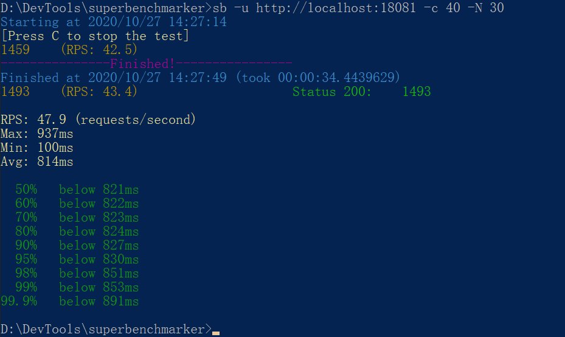
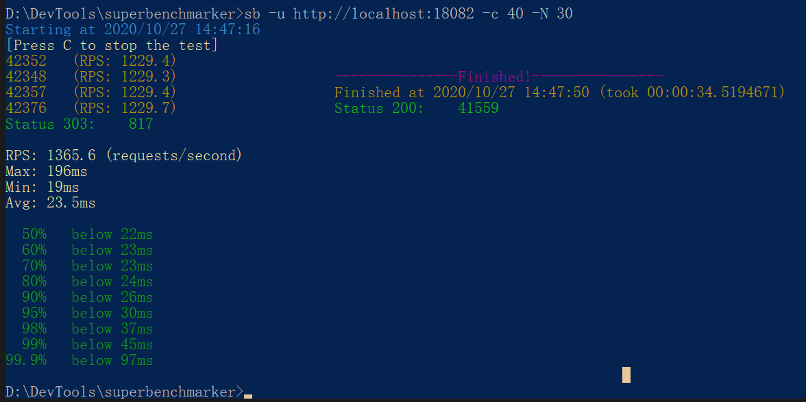
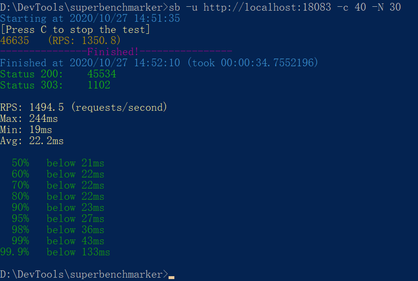
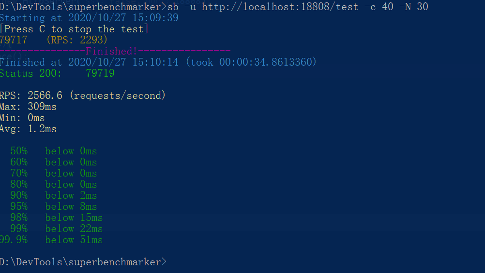

# NIO作业  

## 1、（可选）运行课上的例子，以及 Netty 的例子，分析相关现象。

### 测试环境说明

基本运行环境：windows 10, 16G内存
压测工具：SuperBenchmarker
java程序启动：使用Intellj IDEA 2020.2.3，若无特别说明，启动时都指定了JVM堆大小 `-Xms512m -Xmx512m` 

### 1.1 HTTP Server版本1
代码参见`com.prayerlaputa.homework.nio.httpserver.threadandsocket.HttpServer01`

压测命令：`sb -u http://localhost:18081 -c 40 -N 30`
    
测试结果：

结果解读：
- 平均每秒处理请求47.9
- 最大处理时间937ms
- 最小处理时间100ms
- 平均处理时间814ms
- 95分位数830ms; 99分位数853ms

### 1.2 HTTP Server版本2：创建新线程处理socket

代码参见`com.prayerlaputa.homework.nio.httpserver.threadandsocket.HttpServer02`

压测命令：`sb -u http://localhost:18082 -c 40 -N 30`
    
测试结果：

结果解读：
- 平均每秒处理请求1365.6
- 最大处理时间196ms
- 最小处理时间19ms
- 平均处理时间23.5ms
- 95分位数30ms; 99分位数45ms

结果说明：性能比上个版本要高出很多，说明引入线程可以提高处理效率，因为上个版本只有一个线程在干活儿，而这个版本将业务逻辑放到一个额外线程处理，主线程只是负责分活儿。

### 1.3 HTTP Server版本3：使用线程池处理socket

代码参见`com.prayerlaputa.homework.nio.httpserver.threadandsocket.HttpServer03`

压测命令：`sb -u http://localhost:18082 -c 40 -N 30`
    
测试结果：

结果解读：
- 平均每秒处理请求1494.5
- 最大处理时间244ms
- 最小处理时间19ms
- 平均处理时间22.2ms
- 95分位数27ms; 99分位数43ms

结果说明：与版本2的处理速度相差无几，但版本2是不断创建线程、用完就会销毁，非常浪费线程资源（JVM线程与操作系统线程是1:1）；而引入线程池可以复用线程资源，提高资源利用率。

#### 1.4 HTTP Server版本4：使用Netty

代码参见`com.prayerlaputa.homework.nio.httpserver.netty`包下的所有代码。

压测命令：`sb -u http://localhost:18808 -c 40 -N 30`
    
测试结果：

结果解读：
- 平均每秒处理请求2566.6
- 最大处理时间309ms
- 最小处理时间0ms
- 平均处理时间1.2ms
- 95分位数8ms; 99分位数22ms

结果说明：使用Netty的版本性能更高，因为Netty作为一个高性能网络IO框架，通过以下手段：
- NIO：IO多路复用，同步非阻塞方式，一般使用两个线程池，一个boss、一个worker（默认CPU核心数*2）
- 零拷贝：Netty的零拷贝与Kafka中所利用的零拷贝有所区别，Kafka零拷贝说的是操作系统层面上，减少用户态、内核态之间的拷贝；Netty的零拷贝则是在用户态层面的，比如Netty的文件传输调用FileRegion包装的transferTo方法，可以直接将文件缓冲区的数据发送到目标Channel，避免通过循环write方式导致的内存拷贝问题。更多阐述可以参考这篇 https://www.jianshu.com/p/e488c8ee5b57

## 2、写一段代码，使用 HttpClient 或 OkHttp 访问 http://localhost:8801

代码参见`com.prayerlaputa.homework.nio.httpclient.OkHttpClientDemo`。

参考资料：https://square.github.io/okhttp/#get-a-url