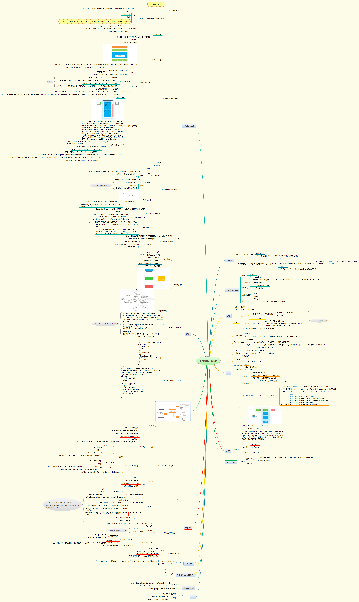

# 说明

## 作业1

思考有多少种方式，在 main 函数启动一个新线程，运行一个方法，拿到这个方法的返回值后，退出主线程？

### 实现
参见src/main/java/com/prayerlaputa/homework3/solution

目前实现了如下几种方案：  
- wait/notify ：参见 Solution1WaitNotify.java
    
    - 利用锁来控制线程执行顺序
- threadpool + Future : 参见 Solution2ThreadPoolFuture.java
    
    - 利用Future可以阻塞、等待返回值的特性
- thread join : 参见 Solution3ThreadJoin.java
    
    - 利用线程调用join方法时，将等待的特性
- CountDownLatch : 参见 Solution4CountDownLatch.java
    - 本质还是用锁控制线程执行顺序，不过是换了一种锁
    - 类似的还可以采用CyclicBarrier、LockSupport.park/unpark，锁不一样而已，此处就不写了
- ReentrantLock + Condition : 参见 Solution5ReentrantLock.java
    
    - 这个使用了可重入锁
- blocking queue : 参见Solution6BlockingQueue.java
    
    - 利用阻塞队列实现
- CompletableFuture : 参见Solution7CompletableFuture.java
    
    - 使用CompletableFuture，本质还是Future
- CAS : 参见Solution8CAS.java
    - 使用CAS的思想，主线程空转，直至与子线程共享的变量值发生变化
    - 注意必须加上volatile，保证变量的可见性
    
    
## 作业2

把多线程和并发相关知识带你梳理一遍，画一个脑图，截图上传到github 上。

### 提交作业

参见 src/multi_thread_and_high_concurrency.png

注意，这个图目前是看java训练营+极客时间其他专栏+其他各种课程/资料后，总结的图，目前只是初步完成，有待进一步完善。

最近个人时间比较紧张，先这样吧。

