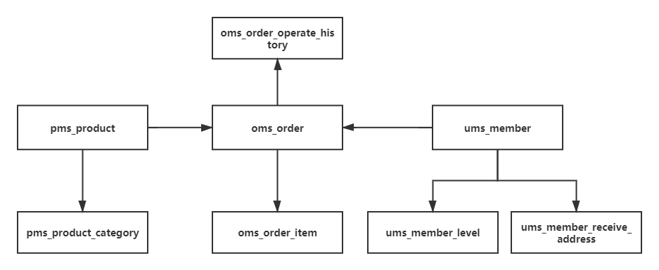

## 学习笔记


## week 6 作业

- 1、（选做）：基于课程中的设计原则和最佳实践，分析是否可以将自己负责的业务系 统进行数据库设计或是数据库服务器方面的优化。 
- 2、（必做）：基于电商交易场景（用户、商品、订单），设计一套简单的表结构，提交DDL的SQL文件到Github（后面2周的作业依然要是用到这个表结构）。 
- 3、（选做）：尽可能多的从“常见关系数据库”中列的清单，安装运行，并使用上一题 的SQL测试简单的增删改查。 
- 4、（选做）：基于上一题，尝试对各个数据库测试100万订单数据的增删改查性能。 
- 5、（选做）：尝试对MySQL不同引擎下测试100万订单数据的增删改查性能。 
- 6、（选做）：模拟1000万订单数据，测试不同方式下导入导出（数据备份还原） MySQL的速度，包括jdbc程序处理和命令行处理。思考和实践，如何提升处理效率。 
- 7、（选做）：对MySQL配置不同的数据库连接池（DBCP、C3P0、Druid、Hikari）， 测试增删改查100万次，对比性能，生成报告。

### 已完成作业

#### 2、必做  用户、商品、订单表设计

借鉴（偷懒）了这个项目https://github.com/macrozheng/mall 的表设计，单独摘出来了用户、商品、订单相关的表。



- 用户相关

  - ums_member
    - 用户基本信息
  - ums_member_level
    - 保存用户有哪些级别
  - ums_member_receive_address
    - 用户的收件信息(手机、详细地址等)

- 订单相关

  - oms_order
    - 订单信息，包括购买用户、商品，订单状态、优惠券和促销、发票等信息，一个订单中可能包含有多个商品，每个商品的详细信息需要保存到oms_order_item中。
  - oms_order_item
    - 订单明细信息，保存订单中单个商品的信息，通过order_id字段与oms_order关联
  - oms_order_operate_history
    - 订单操作记录表，用于审计、回溯等

- 商品相关

  - pms_product

    - 商品信息表

  - pms_product_category

    - 保存商品有哪些分类，如服装、图书等

##### DDL

 ```SQL

DROP TABLE IF EXISTS `oms_order`;
/*!40101 SET @saved_cs_client     = @@character_set_client */;
/*!40101 SET character_set_client = utf8 */;
CREATE TABLE `oms_order` (
  `id` bigint(20) NOT NULL AUTO_INCREMENT COMMENT '订单id',
  `member_id` bigint(20) NOT NULL COMMENT '用户id',
  `coupon_id` bigint(20) DEFAULT NULL COMMENT '优惠券id',
  `order_sn` varchar(64) DEFAULT NULL COMMENT '订单编号',
  `create_time` datetime DEFAULT NULL COMMENT '提交时间',
  `member_username` varchar(64) DEFAULT NULL COMMENT '用户帐号',
  `total_amount` decimal(10,2) DEFAULT NULL COMMENT '订单总金额',
  `pay_amount` decimal(10,2) DEFAULT NULL COMMENT '应付金额（实际支付金额）',
  `freight_amount` decimal(10,2) DEFAULT NULL COMMENT '运费金额',
  `promotion_amount` decimal(10,2) DEFAULT NULL COMMENT '促销优化金额（促销价、满减、阶梯价）',
  `integration_amount` decimal(10,2) DEFAULT NULL COMMENT '积分抵扣金额',
  `coupon_amount` decimal(10,2) DEFAULT NULL COMMENT '优惠券抵扣金额',
  `discount_amount` decimal(10,2) DEFAULT NULL COMMENT '管理员后台调整订单使用的折扣金额',
  `pay_type` int(1) DEFAULT NULL COMMENT '支付方式：0->未支付；1->支付宝；2->微信',
  `source_type` int(1) DEFAULT NULL COMMENT '订单来源：0->PC订单；1->app订单',
  `status` int(1) DEFAULT NULL COMMENT '订单状态：0->待付款；1->待发货；2->已发货；3->已完成；4->已关闭；5->无效订单',
  `order_type` int(1) DEFAULT NULL COMMENT '订单类型：0->正常订单；1->秒杀订单',
  `delivery_company` varchar(64) DEFAULT NULL COMMENT '物流公司(配送方式)',
  `delivery_sn` varchar(64) DEFAULT NULL COMMENT '物流单号',
  `auto_confirm_day` int(11) DEFAULT NULL COMMENT '自动确认时间（天）',
  `integration` int(11) DEFAULT NULL COMMENT '可以获得的积分',
  `growth` int(11) DEFAULT NULL COMMENT '可以活动的成长值',
  `promotion_info` varchar(100) DEFAULT NULL COMMENT '活动信息',
  `bill_type` int(1) DEFAULT NULL COMMENT '发票类型：0->不开发票；1->电子发票；2->纸质发票',
  `bill_header` varchar(200) DEFAULT NULL COMMENT '发票抬头',
  `bill_content` varchar(200) DEFAULT NULL COMMENT '发票内容',
  `bill_receiver_phone` varchar(32) DEFAULT NULL COMMENT '收票人电话',
  `bill_receiver_email` varchar(64) DEFAULT NULL COMMENT '收票人邮箱',
  `receiver_name` varchar(100) NOT NULL COMMENT '收货人姓名',
  `receiver_phone` varchar(32) NOT NULL COMMENT '收货人电话',
  `receiver_post_code` varchar(32) DEFAULT NULL COMMENT '收货人邮编',
  `receiver_province` varchar(32) DEFAULT NULL COMMENT '省份/直辖市',
  `receiver_city` varchar(32) DEFAULT NULL COMMENT '城市',
  `receiver_region` varchar(32) DEFAULT NULL COMMENT '区',
  `receiver_detail_address` varchar(200) DEFAULT NULL COMMENT '详细地址',
  `note` varchar(500) DEFAULT NULL COMMENT '订单备注',
  `confirm_status` int(1) DEFAULT NULL COMMENT '确认收货状态：0->未确认；1->已确认',
  `delete_status` int(1) NOT NULL DEFAULT '0' COMMENT '删除状态：0->未删除；1->已删除',
  `use_integration` int(11) DEFAULT NULL COMMENT '下单时使用的积分',
  `payment_time` datetime DEFAULT NULL COMMENT '支付时间',
  `delivery_time` datetime DEFAULT NULL COMMENT '发货时间',
  `receive_time` datetime DEFAULT NULL COMMENT '确认收货时间',
  `comment_time` datetime DEFAULT NULL COMMENT '评价时间',
  `modify_time` datetime DEFAULT NULL COMMENT '修改时间',
  PRIMARY KEY (`id`)
) ENGINE=InnoDB AUTO_INCREMENT=31 DEFAULT CHARSET=utf8 COMMENT='订单表';
/*!40101 SET character_set_client = @saved_cs_client */;


--
-- Table structure for table `oms_order_item`
--

DROP TABLE IF EXISTS `oms_order_item`;
/*!40101 SET @saved_cs_client     = @@character_set_client */;
/*!40101 SET character_set_client = utf8 */;
CREATE TABLE `oms_order_item` (
  `id` bigint(20) NOT NULL AUTO_INCREMENT,
  `order_id` bigint(20) DEFAULT NULL COMMENT '订单id',
  `order_sn` varchar(64) DEFAULT NULL COMMENT '订单编号',
  `product_id` bigint(20) DEFAULT NULL COMMENT '商品id',
  `product_pic` varchar(500) DEFAULT NULL COMMENT '商品图片id',
  `product_name` varchar(200) DEFAULT NULL COMMENT '商品名称',
  `product_brand` varchar(200) DEFAULT NULL COMMENT '商品品牌',
  `product_sn` varchar(64) DEFAULT NULL COMMENT '商品sn',
  `product_price` decimal(10,2) DEFAULT NULL COMMENT '销售价格',
  `product_quantity` int(11) DEFAULT NULL COMMENT '购买数量',
  `product_sku_id` bigint(20) DEFAULT NULL COMMENT '商品sku编号',
  `product_sku_code` varchar(50) DEFAULT NULL COMMENT '商品sku条码',
  `product_category_id` bigint(20) DEFAULT NULL COMMENT '商品分类id',
  `promotion_name` varchar(200) DEFAULT NULL COMMENT '商品促销名称',
  `promotion_amount` decimal(10,2) DEFAULT NULL COMMENT '商品促销分解金额',
  `coupon_amount` decimal(10,2) DEFAULT NULL COMMENT '优惠券优惠分解金额',
  `integration_amount` decimal(10,2) DEFAULT NULL COMMENT '积分优惠分解金额',
  `real_amount` decimal(10,2) DEFAULT NULL COMMENT '该商品经过优惠后的分解金额',
  `gift_integration` int(11) DEFAULT '0' COMMENT '赠送积分',
  `gift_growth` int(11) DEFAULT '0' COMMENT '赠送成长值',
  `product_attr` varchar(500) DEFAULT NULL COMMENT '商品销售属性:[{"key":"颜色","value":"颜色"},{"key":"容量","value":"4G"}]',
  PRIMARY KEY (`id`)
) ENGINE=InnoDB AUTO_INCREMENT=53 DEFAULT CHARSET=utf8 COMMENT='订单中所包含的商品';
/*!40101 SET character_set_client = @saved_cs_client */;


DROP TABLE IF EXISTS `oms_order_operate_history`;
/*!40101 SET @saved_cs_client     = @@character_set_client */;
/*!40101 SET character_set_client = utf8 */;
CREATE TABLE `oms_order_operate_history` (
  `id` bigint(20) NOT NULL AUTO_INCREMENT,
  `order_id` bigint(20) DEFAULT NULL COMMENT '订单id',
  `operate_man` varchar(100) DEFAULT NULL COMMENT '操作人：用户；系统；后台管理员',
  `create_time` datetime DEFAULT NULL COMMENT '操作时间',
  `order_status` int(1) DEFAULT NULL COMMENT '订单状态：0->待付款；1->待发货；2->已发货；3->已完成；4->已关闭；5->无效订单',
  `note` varchar(500) DEFAULT NULL COMMENT '备注',
  PRIMARY KEY (`id`)
) ENGINE=InnoDB AUTO_INCREMENT=27 DEFAULT CHARSET=utf8 COMMENT='订单操作历史记录';
/*!40101 SET character_set_client = @saved_cs_client */;


--
-- Table structure for table `pms_product`
--

DROP TABLE IF EXISTS `pms_product`;
/*!40101 SET @saved_cs_client     = @@character_set_client */;
/*!40101 SET character_set_client = utf8 */;
CREATE TABLE `pms_product` (
  `id` bigint(20) NOT NULL AUTO_INCREMENT,
  `brand_id` bigint(20) DEFAULT NULL COMMENT '品牌id',
  `product_category_id` bigint(20) DEFAULT NULL COMMENT '商品分类',
  `feight_template_id` bigint(20) DEFAULT NULL,
  `product_attribute_category_id` bigint(20) DEFAULT NULL,
  `name` varchar(64) NOT NULL COMMENT '商品名称',
  `pic` varchar(255) DEFAULT NULL COMMENT '商品图片',
  `product_sn` varchar(64) NOT NULL COMMENT '货号',
  `delete_status` int(1) DEFAULT NULL COMMENT '删除状态：0->未删除；1->已删除',
  `publish_status` int(1) DEFAULT NULL COMMENT '上架状态：0->下架；1->上架',
  `new_status` int(1) DEFAULT NULL COMMENT '新品状态:0->不是新品；1->新品',
  `recommand_status` int(1) DEFAULT NULL COMMENT '推荐状态；0->不推荐；1->推荐',
  `verify_status` int(1) DEFAULT NULL COMMENT '审核状态：0->未审核；1->审核通过',
  `sort` int(11) DEFAULT NULL COMMENT '排序',
  `sale` int(11) DEFAULT NULL COMMENT '销量',
  `price` decimal(10,2) DEFAULT NULL,
  `promotion_price` decimal(10,2) DEFAULT NULL COMMENT '促销价格',
  `gift_growth` int(11) DEFAULT '0' COMMENT '赠送的成长值',
  `gift_point` int(11) DEFAULT '0' COMMENT '赠送的积分',
  `use_point_limit` int(11) DEFAULT NULL COMMENT '限制使用的积分数',
  `sub_title` varchar(255) DEFAULT NULL COMMENT '副标题',
  `description` text COMMENT '商品描述',
  `original_price` decimal(10,2) DEFAULT NULL COMMENT '市场价',
  `stock` int(11) DEFAULT NULL COMMENT '库存',
  `low_stock` int(11) DEFAULT NULL COMMENT '库存预警值',
  `unit` varchar(16) DEFAULT NULL COMMENT '单位',
  `weight` decimal(10,2) DEFAULT NULL COMMENT '商品重量，默认为克',
  `preview_status` int(1) DEFAULT NULL COMMENT '是否为预告商品：0->不是；1->是',
  `service_ids` varchar(64) DEFAULT NULL COMMENT '以逗号分割的产品服务：1->无忧退货；2->快速退款；3->免费包邮',
  `keywords` varchar(255) DEFAULT NULL,
  `note` varchar(255) DEFAULT NULL,
  `album_pics` varchar(255) DEFAULT NULL COMMENT '画册图片，连产品图片限制为5张，以逗号分割',
  `detail_title` varchar(255) DEFAULT NULL,
  `detail_desc` text,
  `detail_html` text COMMENT '产品详情网页内容',
  `detail_mobile_html` text COMMENT '移动端网页详情',
  `promotion_start_time` datetime DEFAULT NULL COMMENT '促销开始时间',
  `promotion_end_time` datetime DEFAULT NULL COMMENT '促销结束时间',
  `promotion_per_limit` int(11) DEFAULT NULL COMMENT '活动限购数量',
  `promotion_type` int(1) DEFAULT NULL COMMENT '促销类型：0->没有促销使用原价;1->使用促销价；2->使用会员价；3->使用阶梯价格；4->使用满减价格；5->限时购',
  `brand_name` varchar(255) DEFAULT NULL COMMENT '品牌名称',
  `product_category_name` varchar(255) DEFAULT NULL COMMENT '商品分类名称',
  PRIMARY KEY (`id`)
) ENGINE=InnoDB AUTO_INCREMENT=37 DEFAULT CHARSET=utf8 COMMENT='商品信息';
/*!40101 SET character_set_client = @saved_cs_client */;


--
-- Table structure for table `pms_product_category`
--

DROP TABLE IF EXISTS `pms_product_category`;
/*!40101 SET @saved_cs_client     = @@character_set_client */;
/*!40101 SET character_set_client = utf8 */;
CREATE TABLE `pms_product_category` (
  `id` bigint(20) NOT NULL AUTO_INCREMENT,
  `parent_id` bigint(20) DEFAULT NULL COMMENT '上机分类的编号：0表示一级分类',
  `name` varchar(64) DEFAULT NULL,
  `level` int(1) DEFAULT NULL COMMENT '分类级别：0->1级；1->2级',
  `product_count` int(11) DEFAULT NULL,
  `product_unit` varchar(64) DEFAULT NULL,
  `nav_status` int(1) DEFAULT NULL COMMENT '是否显示在导航栏：0->不显示；1->显示',
  `show_status` int(1) DEFAULT NULL COMMENT '显示状态：0->不显示；1->显示',
  `sort` int(11) DEFAULT NULL,
  `icon` varchar(255) DEFAULT NULL COMMENT '图标',
  `keywords` varchar(255) DEFAULT NULL,
  `description` text COMMENT '描述',
  PRIMARY KEY (`id`)
) ENGINE=InnoDB AUTO_INCREMENT=53 DEFAULT CHARSET=utf8 COMMENT='产品分类';
/*!40101 SET character_set_client = @saved_cs_client */;

--


--
-- Table structure for table `ums_member`
--

DROP TABLE IF EXISTS `ums_member`;
/*!40101 SET @saved_cs_client     = @@character_set_client */;
/*!40101 SET character_set_client = utf8 */;
CREATE TABLE `ums_member` (
  `id` bigint(20) NOT NULL AUTO_INCREMENT,
  `member_level_id` bigint(20) DEFAULT NULL,
  `username` varchar(64) DEFAULT NULL COMMENT '用户名',
  `password` varchar(64) DEFAULT NULL COMMENT '密码',
  `nickname` varchar(64) DEFAULT NULL COMMENT '昵称',
  `phone` varchar(64) DEFAULT NULL COMMENT '手机号码',
  `status` int(1) DEFAULT NULL COMMENT '帐号启用状态:0->禁用；1->启用',
  `create_time` datetime DEFAULT NULL COMMENT '注册时间',
  `icon` varchar(500) DEFAULT NULL COMMENT '头像',
  `gender` int(1) DEFAULT NULL COMMENT '性别：0->未知；1->男；2->女',
  `birthday` date DEFAULT NULL COMMENT '生日',
  `city` varchar(64) DEFAULT NULL COMMENT '所做城市',
  `job` varchar(100) DEFAULT NULL COMMENT '职业',
  `personalized_signature` varchar(200) DEFAULT NULL COMMENT '个性签名',
  `source_type` int(1) DEFAULT NULL COMMENT '用户来源',
  `integration` int(11) DEFAULT NULL COMMENT '积分',
  `growth` int(11) DEFAULT NULL COMMENT '成长值',
  `luckey_count` int(11) DEFAULT NULL COMMENT '剩余抽奖次数',
  `history_integration` int(11) DEFAULT NULL COMMENT '历史积分数量',
  PRIMARY KEY (`id`),
  UNIQUE KEY `idx_username` (`username`),
  UNIQUE KEY `idx_phone` (`phone`)
) ENGINE=InnoDB AUTO_INCREMENT=10 DEFAULT CHARSET=utf8 COMMENT='会员表';
/*!40101 SET character_set_client = @saved_cs_client */;


--
-- Table structure for table `ums_member_level`
--

DROP TABLE IF EXISTS `ums_member_level`;
/*!40101 SET @saved_cs_client     = @@character_set_client */;
/*!40101 SET character_set_client = utf8 */;
CREATE TABLE `ums_member_level` (
  `id` bigint(20) NOT NULL AUTO_INCREMENT,
  `name` varchar(100) DEFAULT NULL,
  `growth_point` int(11) DEFAULT NULL,
  `default_status` int(1) DEFAULT NULL COMMENT '是否为默认等级：0->不是；1->是',
  `free_freight_point` decimal(10,2) DEFAULT NULL COMMENT '免运费标准',
  `comment_growth_point` int(11) DEFAULT NULL COMMENT '每次评价获取的成长值',
  `priviledge_free_freight` int(1) DEFAULT NULL COMMENT '是否有免邮特权',
  `priviledge_sign_in` int(1) DEFAULT NULL COMMENT '是否有签到特权',
  `priviledge_comment` int(1) DEFAULT NULL COMMENT '是否有评论获奖励特权',
  `priviledge_promotion` int(1) DEFAULT NULL COMMENT '是否有专享活动特权',
  `priviledge_member_price` int(1) DEFAULT NULL COMMENT '是否有会员价格特权',
  `priviledge_birthday` int(1) DEFAULT NULL COMMENT '是否有生日特权',
  `note` varchar(200) DEFAULT NULL,
  PRIMARY KEY (`id`)
) ENGINE=InnoDB AUTO_INCREMENT=5 DEFAULT CHARSET=utf8 COMMENT='会员等级表';
/*!40101 SET character_set_client = @saved_cs_client */;


--
-- Table structure for table `ums_member_receive_address`
--

DROP TABLE IF EXISTS `ums_member_receive_address`;
/*!40101 SET @saved_cs_client     = @@character_set_client */;
/*!40101 SET character_set_client = utf8 */;
CREATE TABLE `ums_member_receive_address` (
  `id` bigint(20) NOT NULL AUTO_INCREMENT,
  `member_id` bigint(20) DEFAULT NULL,
  `name` varchar(100) DEFAULT NULL COMMENT '收货人名称',
  `phone_number` varchar(64) DEFAULT NULL,
  `default_status` int(1) DEFAULT NULL COMMENT '是否为默认',
  `post_code` varchar(100) DEFAULT NULL COMMENT '邮政编码',
  `province` varchar(100) DEFAULT NULL COMMENT '省份/直辖市',
  `city` varchar(100) DEFAULT NULL COMMENT '城市',
  `region` varchar(100) DEFAULT NULL COMMENT '区',
  `detail_address` varchar(128) DEFAULT NULL COMMENT '详细地址(街道)',
  PRIMARY KEY (`id`)
) ENGINE=InnoDB AUTO_INCREMENT=5 DEFAULT CHARSET=utf8 COMMENT='会员收货地址表';
/*!40101 SET character_set_client = @saved_cs_client */;


 ```

