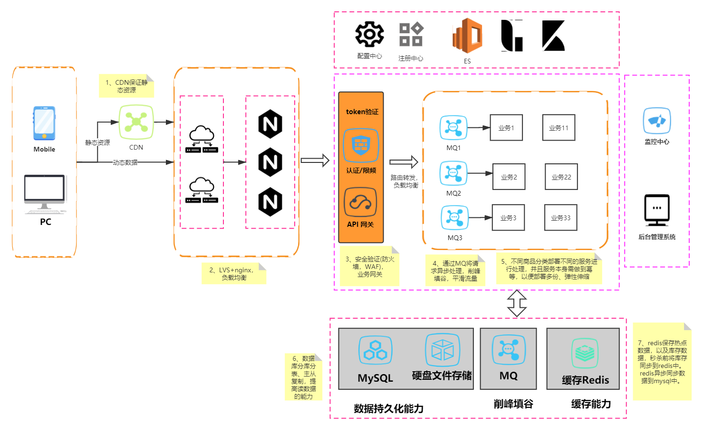
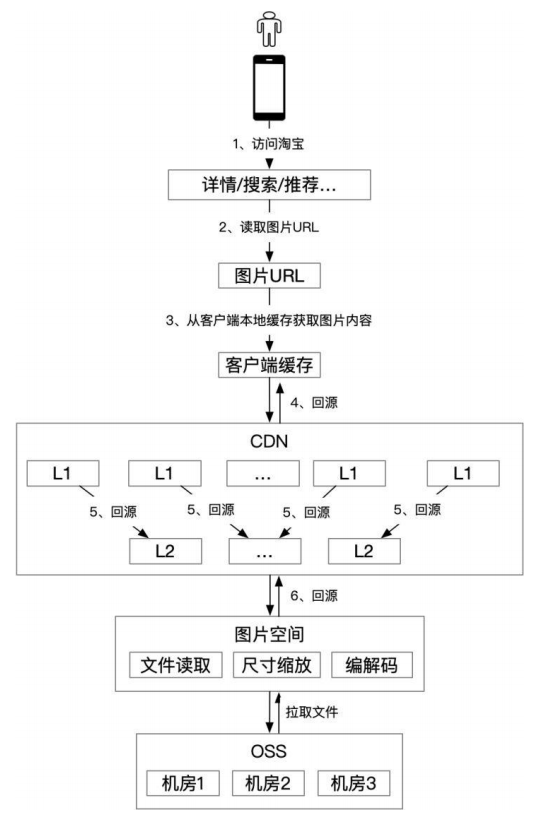
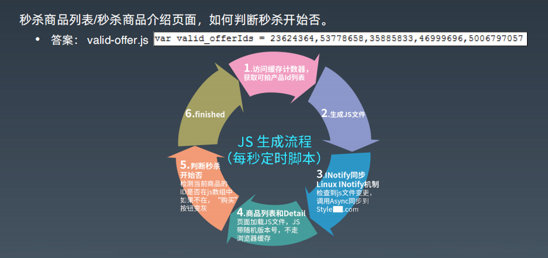
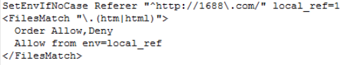

# 秒杀系统设计方案

## 1、需求整理

### 1.1 功能需求  

假定秒杀功能需求如下（类似双十一）：

- X月X日0点，电商网站上多个品类的n多个商家将推出m款商品，每款商品供 100件，每人限批 3 件。
- 商家推广力度很大，CCTV 黄金广告时间，各种网络，平面媒体轰炸。
- 预计秒杀活动时预计每个品类都将有上万人参与

### 1.2 非功能需求

- 支持上万人参与秒杀
- 防秒杀器

## 2、设计方案

### 2.1 现状分析

#### 2.1.1 系统现状

首先需要分析目前系统的现状，假定当前系统：

- 并发（单台），高峰期 < 10； 
- 吞吐量（TPS，单台） 高峰期，<60； 
- CPU负载 Load 高峰期，<2，大部分服务器 <1； 
- CPU使用率 ， 一般只占 1 颗核，平均 60% 左右；
- 服务器平均响应时间 高峰期 ， <150ms； 
- 图片总流量带宽 1.8G（各网站总合）。

#### 2.1.2 其他情况

需要确认如下内容：

- 可以投入的开发资源有多少、技术熟练程度
- 可以投入的预算
- 可以调配的服务器资源
- 对销售不足或是超卖的容忍度
- 领导层愿意付出多大代价、支持到何种力度？
- 。。。。。。

此处略过。

分析可行性：

- 直接改造已有系统的话，风险会比较大，可以单独开发一套新的系统，只用来支持秒杀，避免对现有业务造成影响
- 业务上拆解，支付可以在下订单后30min内完成即可，减少秒杀时的压力
- CDN、页面静态化等技术手段，将整个秒杀系统分层，逐层减少透传到下一层的请求数量
- POC验证，压测，确定性能基线，准备服务器

### 2.2 基本设计

#### 2.2.1 整体设计原则

- 静态化
- 流程简化
- 分层，逐层减少请求数量

#### 2.2.2 整体架构设计

#### 2.2.3 技术优化点详述

##### 1、在前端随机丢弃请求

因为是秒杀，随机丢弃一些请求并没有问题

##### 2、静态资源保存在CDN

此处还可以做一些优化，比如：

- 图片压缩：采用tinypng等格式，减少图片下载所占用的流量
- 根据客户端类型（PC还是手机客户端），请求不同尺寸的图片
- 客户端拉取图片后，本地也可以做图片缓存
- CDN本身可以分层，此处可以参考 阿里《技术人的百宝黑皮书》

##### 3、负载均衡

可以采用常用的LVS+nginx的方式实现负载均衡。

- LVS：四层负载均衡，主备部署，提高可用性
- nginx：七层负载均衡，可以采用keepalived+nginx主备高可用部署方式

##### 4、使用队列，异步处理、平滑流量

使用可堆积的消息队列或者内存消息队列。请求先进队列，库存都扣减完之后，剩余的请求直接做秒杀失败处理。

- 内存队列：可以选用disruptor
- 其他：kafka、rocketmq等

##### 5、库存放入内存或是内存数据网格中，直接内存扣减库存

可以使用内存或是内存数据网格（Hazelcast/Gemfire/Apache Ignite等）。

保存库存数据，秒杀前将库存写入到内存或是内存数据网格，**预热**。避免了分布式锁，能提升不少性能。

秒杀业务逻辑每次将内存中的库存进行增加后，可以直接返回，在秒杀业务逻辑返回前提交一个异步任务进行处理、保证mysql中的数据与内存中的数据最终一致性。

**注意必须提前预热好，集群中每个节点分别分配一定的库存量，多个节点并行处理。**

##### 6、热点数据放入redis

加速读请求的处理，**redis集群+主从部署，数据分片，可以采用一致性hash。**

**注意数据预热！！！**

##### 7、服务拆分、扩展

针对不同类型、不同商家、不同来源的商品，部署不同的前端促销集群， 这样就把压力分散开了。

注意业务逻辑需要支持**幂等**，方便弹性伸缩。

部署时需要先压测、确认好基线，以便确认秒杀前需要部署的服务实例数量。

##### 8、服务降级

业务上不必在秒杀时做所有业务逻辑，将可以延后处理的单独摘出来。

比如说秒杀时，关键的是下订单这一步骤，支付环节可以在秒杀成功后一段时间内完成即可（比如1小时），这样在业务上就平滑了流量。

##### 9、页面静态化

设计尽量简单，减少页面交互，页面静态化，这样页面就可以放到CDN上，秒杀开始时只需要获取秒杀商品列表、秒杀详情即可，减少流量。

静态化还可以采用一系列优化技术，如图片压缩、图片合并、HTML压缩，精简CSS、JS等

#### 2.2.4 其他问题

##### 1、如何判断秒杀开始？

秒杀时点击购买、发送请求时每个商品都需要带上自己的token，而这个token在秒杀开始前分发下去。没有token则请求根本不会透传到后端。

##### 2、秒杀器的预防

- 秒杀详情页
  - URL随机
  - 在秒杀前2-3才放出，由脚本生成，分发出去
  - 每个商品设置访问次数上限
- 下单页面
  - 订单ID随机
  - 不能直接跳过秒杀详情页
    - 比如apache服务器可以这样设置：
    - 
  - 每个秒杀商品，带预先生成的随机 Token 作 URL 参数
  - 如果秒杀过，直接跳到秒杀结束页面。
  - 100 次访问上限控制【每件商品只能放入1000人下单】。

##### 3、务必进行压测

##### 4、其他优化点

- 采用更轻、更快的服务器
- 静态页面优化
  - 图片合并
  - HTML内容压缩，JS、CSS精简
  - 图片压缩
  - 。。。。。
- 下单页面优化
  - 流程精简
    - 收件地址等秒杀后再填写
  - 热点用缓存
- 性能调优
  - JVM
  - 关闭 KeepAlive（分析交易系统 accesslog，用户在短时间内连续点击概率很低）

### 2.3 应急预案

- 域名分离，独立域名，不影响XXXX原有业务。
- 除了专门的秒杀服务器资源，额外准备10台服务器，备用
- 所有办法均失效的情况下，例如流量耗尽。
  - 非核心应用集群统统停止服务
  - 保住首页
- 万能出错页面：秒杀活动已经结束
  - 任何出错都 302 跳转到此页面
  - 该页面需位于其他集群

## 参考资料

- 极客时间 架构训练营 秒杀相关章节
- 极客时间 java训练营 秒杀相关章节
- https://github.com/qiurunze123/miaosha